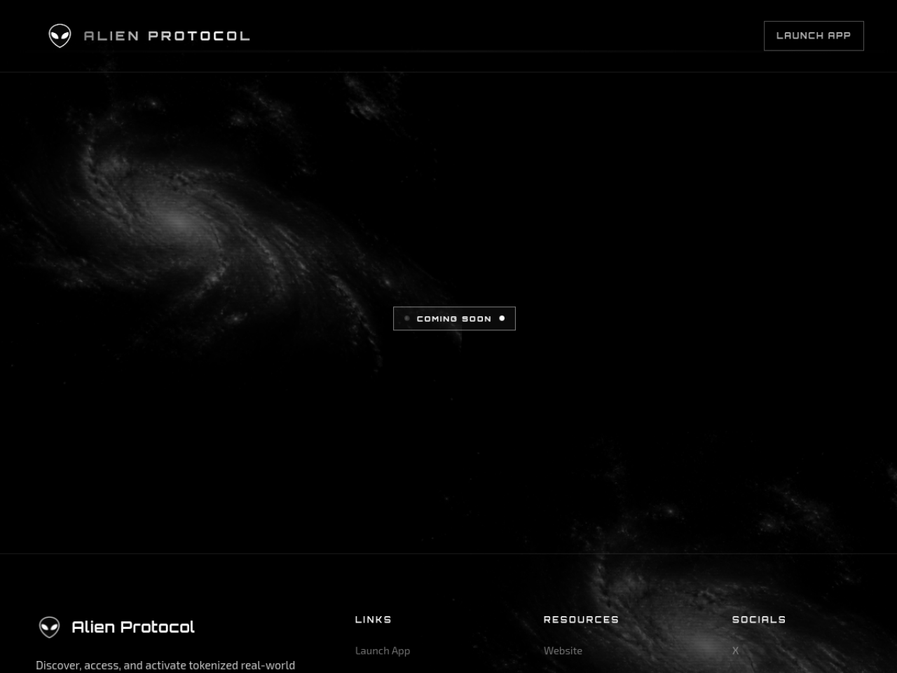
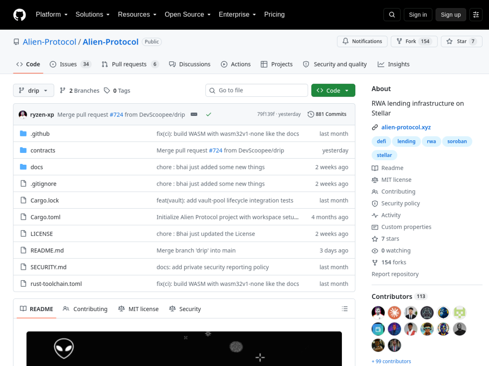

# Alien Protocol — Stellar Wave Research Submission

## Project Selected

- **Project:** Alien Protocol
- **Wave source:** [`Alien-Protocol/Alien-Protocol`](https://www.drips.network/wave/users/04546302-c502-4765-88f0-b373daab41a4), listed in the Stellar Wave Program directory on Drips
- **Category:** DeFi (RWA lending infrastructure)
- **Repository:** https://github.com/Alien-Protocol/Alien-Protocol
- **Live application:** https://www.alien-protocol.xyz (pre-launch landing page)
- **Network:** Stellar Testnet (target; no deployments yet)

## Eligibility And Duplicate Check

Alien Protocol is listed in the Stellar Wave Program directory on Drips. Hub
searches for `alien` and related terms returned zero matches when this
research was prepared, so it was not already listed on Stellar Wave Hub.

## What Alien Protocol Does

Alien Protocol is a modular credit layer for tokenized real-world assets
(RWA) on Stellar: users deposit tokenized RWA collateral, borrow USDC or XLM
against it, and the protocol manages risk through a set of focused Soroban
contracts rather than one monolith. Collateral custody, liquidity, pricing,
and liquidation each live in their own contract so the lending lifecycle can
evolve piece by piece.

The Rust workspace (Soroban SDK 23, 39 source files, 31 test files) is
organized into five crates:

- **`collateral-vault`** — collateral deposits and withdrawals, asset
  allowlisting, per-user position tracking, position valuation, and seizure;
  the most complete module, including upgrade tests that load the release
  WASM at compile time.
- **`oracle-adapter`** — asset price publication with staleness validation,
  authorized price feeders, and integration paths for RedStone oracles in
  both push and pull models.
- **`lending-pool`** — liquidity, borrowing, repayment, and debt accounting
  (implemented, with some mocked components).
- **`liquidation-engine`** — position health monitoring and liquidation
  execution.
- **`shared`** — protocol types, errors, constants, and events shared across
  crates.

What distinguishes the repository is its radical honesty. The README carries
an unmissable warning that the protocol is unaudited and must not hold
production funds, and a per-component status table marking exactly which
modules are in development versus scaffolded. A living `docs/TODO.md` (dated
September 2026) goes further: it states plainly that no testnet deployment
exists ("No scripts, IDs, or network config in-repo"), that cross-contract
tests still use mock oracles, and it prescribes the fix order — close
integration gaps, add deploy scripts, then backend, indexer, and frontend.
`docs/arch.md` provides a 22-section target architecture covering the oracle
system, liquidation engine, risk management, and security design.

Quality automation is solid for this stage: contract CI runs formatting,
Clippy with warnings as errors, cargo check, WASM builds for the
`wasm32v1-none` target, and the full workspace test suite on every push and
PR. The website (alien-protocol.xyz) is a pre-launch landing page announcing
deposit/borrow/earn functionality — consistent with the codebase's actual
state rather than overpromising.

Alien Protocol is therefore best represented as early-stage Soroban lending
infrastructure: a clean, well-tested architectural foundation for RWA credit
on Stellar that has not yet been deployed, integrated end-to-end, or audited.

## On-Chain Verification

- **No deployed contracts (verified absence):** the project's own TODO
  document confirms "Testnet deploy: `[ ]` — No scripts, IDs, or network
  config in-repo." No contract id is asserted in this profile, consistent
  with the maintainer's own status tracking.
- **Contract source (verified):** the five-crate workspace under
  `contracts/` implements the documented custody, oracle, pool, and
  liquidation responsibilities; CI (`.github/workflows/contract.yml`)
  enforces fmt/clippy/build/test on `wasm32v1-none`.
- **Live website (verified):** https://www.alien-protocol.xyz serves the
  pre-launch landing page ("deposit collateral, borrow USDC, and earn on
  Stellar") with links to this repository — confirming the project's public
  presence and its self-declared pre-launch state.

## Screenshots

Included in this directory:

### Project website (alien-protocol.xyz)

### Contracts repository on GitHub

Both images are attached to the Hub submission as research images.

## Suggested Hub Submission

- **Name:** Alien Protocol
- **Category:** DeFi
- **Network:** Testnet
- **Tags:** `soroban, rwa, lending, defi, collateral, oracle, redstone, liquidation, rust, stellar-wave`
- **Website:** https://www.alien-protocol.xyz
- **GitHub repository:** https://github.com/Alien-Protocol/Alien-Protocol
- **Soroban Contract ID:** _(none — no deployments yet, per the project's own TODO; documented rather than asserted)_
- **Stellar Account ID:** _(none published)_

## Hub Submission Confirmed

- **Hub project ID:** `141`
- **Hub slug:** `alien-protocol`
- **Submission status:** `submitted` (awaiting administrator review)
- **Submitted network:** `Testnet`
- **Research images:** 2 uploaded and attached to the Hub record
  ([website](https://dlwcywvybsedgmcggmjn.supabase.co/storage/v1/object/public/research-images/85/1790380390647-8bik12.png),
  [repo](https://dlwcywvybsedgmcggmjn.supabase.co/storage/v1/object/public/research-images/85/1790380391316-aut4by.png))
- **Submitted by:** Syringe7 (contributor #85)

## Sources

1. [Drips Stellar Wave directory](https://www.drips.network/wave/users/04546302-c502-4765-88f0-b373daab41a4) — Alien-Protocol Wave listing
2. [Alien-Protocol repository](https://github.com/Alien-Protocol/Alien-Protocol) — README (architecture, component status table, unaudited warning)
3. [docs/TODO.md](https://github.com/Alien-Protocol/Alien-Protocol/blob/main/docs/TODO.md) — honest status snapshot incl. "no testnet deploy"
4. [docs/arch.md](https://github.com/Alien-Protocol/Alien-Protocol/blob/main/docs/arch.md) — target architecture
5. [.github/workflows/contract.yml](https://github.com/Alien-Protocol/Alien-Protocol/blob/main/.github/workflows/contract.yml) — CI gates
6. [Project website](https://www.alien-protocol.xyz) — verified pre-launch landing page
7. [Stellar Wave Hub search](https://usestellarwavehub.vercel.app) — duplicate check (zero Alien Protocol matches)
