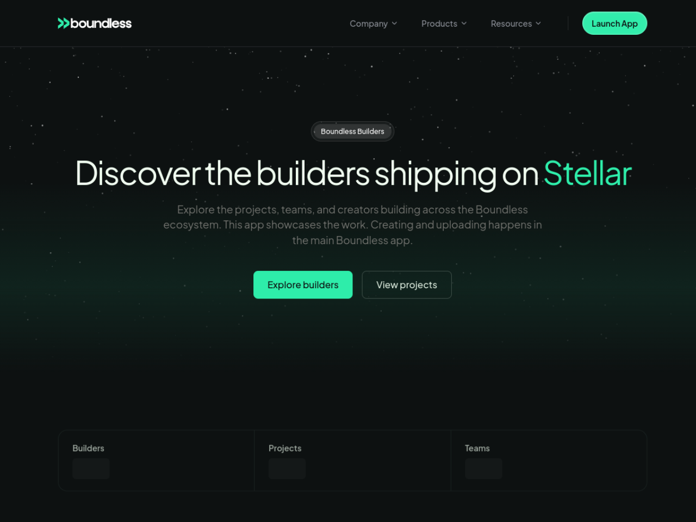

# Boundless Builders — Stellar Wave Research Submission

## Project Selected

- **Project:** Boundless Builders
- **Wave source:** [`boundlessfi/builders`](https://www.drips.network/wave/stellar/repos), listed as an approved repository in the Stellar Wave Program catalog (4x Points tier)
- **Category:** Tools / Community
- **Repository:** https://github.com/boundlessfi/builders
- **Live application:** https://bounties-six.vercel.app (the documented production domain `builders.boundlessfi.xyz` did not resolve from this environment)
- **Network:** Stellar Testnet

## Eligibility And Duplicate Check

Boundless Builders appears in the Drips catalog of repositories approved for
the Stellar Wave Program, and is marked with the catalog's highest "4x Points"
badge. A Hub search for `boundless` returned zero matches when this research
was prepared (`builders` matched only the unrelated BeEnergy and Trustless
Work entries), so it was not already listed on Stellar Wave Hub. OFFER-HUB,
the other candidate for this slot, is already listed on the Hub (project #13).

## What Boundless Builders Is

Boundless Builders is the public showcase for the Boundless platform — a
display-only Next.js 16 application at `builders.boundlessfi.xyz` that
presents the people and work of the ecosystem: builders, their projects and
products, and development teams. The showcase itself is deliberately read-only
(GET flows only); creating, editing, and uploading builders, projects, and
teams happens in the main Boundless app, and this app renders that data. The
repository README is unusually disciplined about this boundary: contributors
are instructed to follow a strict design system (`design.md`), reuse
components, and attach UI screenshots to every frontend change.

The Stellar story lives in the repository's `archive/` directory, which the
README explains transparently: this codebase was repurposed from the original
"bounties" frontend, a separate Stellar bounty app whose creation is being
folded into the main Boundless platform. The archived bounties app is a real,
complete Soroban client: it carries generated-style TypeScript bindings for a
four-contract testnet suite — a Bounty Registry, a Project Registry, a Core
Escrow, and a Reputation Registry — with typed args and results for bounty
lifecycle operations (create, update, apply to bounty), Horizon-backed wallet
activity views, a smart-wallet configuration layer that switches Horizon URLs
by network passphrase, and a config module that resolves the Soroban RPC URL,
Stellar Expert explorer base, and contract ids from environment variables with
testnet fallbacks and loud production errors on misconfiguration.

The archived contracts are deployed and exercised on Stellar Testnet: the
Stellar Expert testnet API confirms all four contract ids exist with nonzero
invocations (the Core Escrow alone shows 81 events and the Reputation Registry
39 invocations), tying the code in the repository to real on-chain
deployments. This makes Boundless Builders a legitimate Wave entry even though
the current showcase app itself is off-chain rendering: the repository
preserves a full, verified Soroban bounty/escrow stack that the platform's
main app is absorbing, on the network the showcase explicitly celebrates
("Discover the builders shipping on Stellar").

## On-Chain Verification

The repository documents four Testnet Soroban contract ids in the archived
TypeScript bindings (`archive/lib/contracts/*/index.ts`), and each was
confirmed deployed on Testnet via the Stellar Expert testnet API:

| Contract | Role | Invocations | Events |
|----------|------|-------------|--------|
| `CBWXIV3DERH4GKADOTEEI2QADGZAMMJT4T2B5LFVZULGHEP5BACK2TLY` | Bounty Registry | 4 | 2 |
| `CCG4QM2GZKBN7GBRAE3PFNE3GM2B6QRS7FOKLHGV2FT2HHETIS7JUVYT` | Project Registry | 8 | 2 |
| `CA3VZVIMGLVG5EJF2ACB3LPMGQ6PID4TJTB3D2B3L6JIZRIS7NQPVPHN` | Core Escrow | 8 | 81 |
| `CBVQEDH4T5KOJQSESL2HEFI2YZWXPSZQ5TASKRNWAVZFIWAKEU74RFF4` | Reputation Registry | 39 | 6 |

All four were created within seconds of each other (timestamps 1774452879–
1774452949) by the same creator account
`GDWW74EUSPUCXFHGBPAK6MZYXAKNR7SZ7GSBZHZB6FH4GBA22XOCWNXC`, which exists on
Testnet per the Horizon accounts endpoint — consistent with a single
coordinated deployment of the bounty suite. The Bounty Registry binding header
in the repository names the same contract id the explorer reports, tying the
code to the chain.

- Bounty Registry: [Stellar Expert](https://stellar.expert/explorer/testnet/contract/CBWXIV3DERH4GKADOTEEI2QADGZAMMJT4T2B5LFVZULGHEP5BACK2TLY)
- Project Registry: [Stellar Expert](https://stellar.expert/explorer/testnet/contract/CCG4QM2GZKBN7GBRAE3PFNE3GM2B6QRS7FOKLHGV2FT2HHETIS7JUVYT)
- Core Escrow: [Stellar Expert](https://stellar.expert/explorer/testnet/contract/CA3VZVIMGLVG5EJF2ACB3LPMGQ6PID4TJTB3D2B3L6JIZRIS7NQPVPHN)
- Reputation Registry: [Stellar Expert](https://stellar.expert/explorer/testnet/contract/CBVQEDH4T5KOJQSESL2HEFI2YZWXPSZQ5TASKRNWAVZFIWAKEU74RFF4)

The current showcase application was verified live at its Vercel deployment
("Discover the builders, projects, and teams shipping on Boundless"), noting
the documented production domain did not resolve from this environment.

## Screenshots

Included in this directory:

### Live showcase landing (Vercel deployment)

This image is also attached to the Hub submission as a research image.

## Suggested Hub Submission

- **Name:** Boundless Builders
- **Category:** Other (community showcase / bounty platform)
- **Network:** Testnet
- **Tags:** `soroban, bounties, escrow, reputation, nextjs, community, stellar-wave`
- **Website:** https://bounties-six.vercel.app
- **GitHub repository:** https://github.com/boundlessfi/builders
- **Soroban Contract ID:** `CBWXIV3DERH4GKADOTEEI2QADGZAMMJT4T2B5LFVZULGHEP5BACK2TLY` (Bounty Registry, Testnet — one of a four-contract suite, all verified)

## Hub Submission Confirmed

- **Hub project ID:** `137`
- **Hub slug:** `boundless-builders`
- **Submission status:** `submitted` (awaiting administrator review)
- **Submitted network:** `Testnet`
- **Research images:** 1 uploaded and attached to the Hub record
  ([showcase landing](https://dlwcywvybsedgmcggmjn.supabase.co/storage/v1/object/public/research-images/85/1790376562051-o1k4ju.png))
- **Submitted by:** Syringe7 (contributor #85)

## Sources

1. [Drips Stellar Wave repository catalog](https://www.drips.network/wave/stellar/repos) — Wave approval listing, 4x Points badge
2. [boundlessfi/builders repository](https://github.com/boundlessfi/builders) — README (showcase scope, archive rationale, tech stack)
3. [Archive bounty-registry bindings](https://github.com/boundlessfi/builders/blob/main/archive/lib/contracts/bounty-registry/index.ts) — Bounty Registry contract id and typed client
4. [Archive project-registry, core-escrow, reputation-registry bindings](https://github.com/boundlessfi/builders/tree/main/archive/lib/contracts) — remaining contract ids
5. [Stellar Expert testnet API](https://stellar.expert/explorer/testnet/contract/CBWXIV3DERH4GKADOTEEI2QADGZAMMJT4T2B5LFVZULGHEP5BACK2TLY) — contract deployment, invocation, and event counts
6. [Horizon Testnet accounts endpoint](https://horizon-testnet.stellar.org/accounts/GDWW74EUSPUCXFHGBPAK6MZYXAKNR7SZ7GSBZHZB6FH4GBA22XOCWNXC) — deployer account existence
7. [Live showcase deployment](https://bounties-six.vercel.app) — verified serving the Boundless Builders app
8. [Stellar Wave Hub search](https://usestellarwavehub.vercel.app) — duplicate check (zero Boundless matches)
