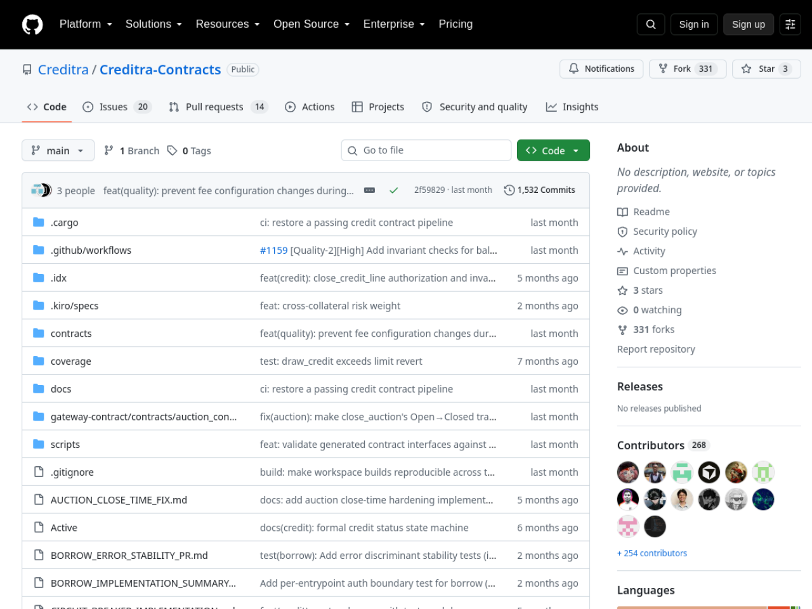
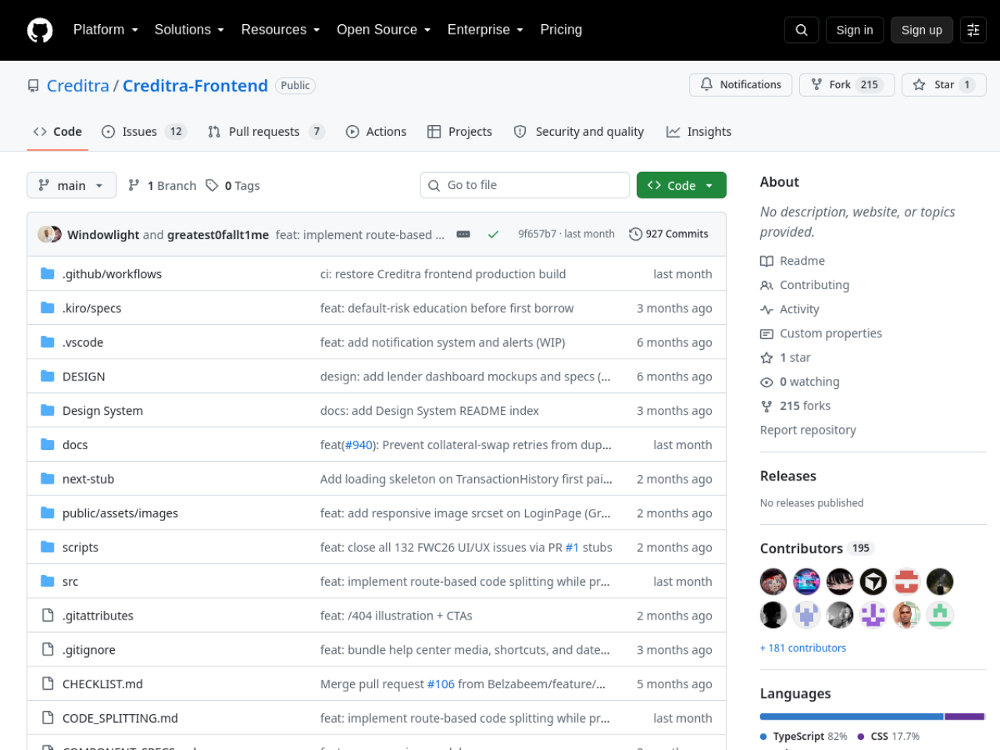

# Creditra — Stellar Wave Research Submission

## Project Selected

- **Project:** Creditra
- **Wave source:** [`Creditra/Creditra-Contracts`](https://www.drips.network/wave/users/04546302-c502-4765-88f0-b373daab41a4), approved in the Stellar Wave Program (Drips-listed repo whose contribution issues carry the `Stellar Wave`, `GrantFox OSS`, and `OFFICIAL CAMPAIGN` labels with 200-point bounties)
- **Category:** DeFi (on-chain credit / lending)
- **Repositories:**
  - Soroban contracts: https://github.com/Creditra/Creditra-Contracts
  - Frontend: https://github.com/Creditra/Creditra-Frontend
  - Backend/indexer: https://github.com/Creditra/Creditra-Backend
- **Live application:** _(none published — repositories only)_
- **Network:** Stellar Testnet (contract target; no public deployment record)

## Eligibility And Duplicate Check

Creditra appears in the Stellar Wave Program directory on Drips (the
`Creditra/Creditra-Contracts` repo is listed under the program with assigned
Wave contribution issues). A Hub search for `creditra` returned zero matches
when this research was prepared, so it was not already listed on Stellar Wave
Hub.

## What Creditra Does

Creditra is a decentralized credit protocol that prices and sizes credit
lines from continuously updated on-chain behavioral signals rather than from
overcollateralized deposits. Where Aave, Compound, MakerDAO, and Liquity
require borrowers to lock 130–150% collateral — which, as the whitepaper
argues, excludes the median wallet from on-chain credit — Creditra maintains
per-borrower credit lines whose interest rate and limit evolve as a
deterministic function of a risk score, utilization, market risk premium, and
a configurable piecewise-linear rate formula. Default events are settled
through a separate auction contract using a one-shot, replay-protected
cross-contract handoff.

The implementation is two Soroban WASM contracts totaling ~14.5 KLOC of Rust
— the credit-line core (`creditra-credit`, `lib.rs` alone 5,449 lines across
13 sub-modules) and a gateway auction contract supporting English and Dutch
modes — plus a standalone risk-admin circuit-breaker contract that time-gates
admin risk mutations. The engineering rigor is the standout: current measured
line coverage of 98.94% from ≥40 integration test files (including
cross-contract conservation and accrual overflow audit suites), a hard 50 KB
CI budget on release WASM built with `opt-level = "z"`, full LTO, and stripped
symbols, and pinned toolchains with floating Rust channels rejected by a
check script. Documentation is exhaustive and audience-routed: a formal
whitepaper whose every formula and constant is claimed reproducible from a
named file and symbol, a protocol spec enumerating every entrypoint, storage
key, and error, architecture and sequence diagrams, a risk-pricing deep-dive
with worked numerical examples, a threat model with auditor checklist and bug
bounty scope, and a glossary with source citations.

The product layer is complete as well: a Next.js/TypeScript frontend
presenting a risk gauge dashboard, credit-line manager, draw/repay flows,
and multi-wallet support (Freighter, Albedo, xBull, Rabet) with WCAG 2.1 AA
accessibility patterns, plus a TypeScript backend/indexer. An operator can
dial an optional collateral floor between fully unsecured and Aave-style —
but eligibility is behavior, not deposit.

The honest limitation is deployment: the contracts compile and test green,
but no deployed testnet contract id is published in any repository artifact,
and no live frontend instance was found. The profile reports this plainly —
Creditra today is a rigorous, near-complete protocol implementation, not a
shipped dApp.

## On-Chain Verification

- **Contract source (verified):** the workspace under
  `contracts/credit/src/` and `gateway-contract/contracts/auction_contract/src/`
  implements the documented credit-line lifecycle (open, draw, repay,
  risk update, default, settle, upgrade), risk-pricing function, and
  auction handoff; CI (`.github/workflows/ci.yml`) runs the full test matrix
  with coverage and WASM budget enforcement.
- **Wave participation (verified):** the Drips program record lists
  `Creditra/Creditra-Contracts` with assigned Wave contribution issues
  (e.g. #479, "Implement protocol-fee skim to treasury on every
  interest-portion repayment", labeled `Stellar Wave`, `GrantFox OSS`,
  `OFFICIAL CAMPAIGN`, 200 points, closed).
- **Deployment (not verifiable from public sources):** `docs/deploy.md`
  contains deployment procedure but no committed contract ids; no frontend
  deployment exists. Consistent with the project's own "active development"
  framing, no contract or account id is asserted in this profile.

## Screenshots

Included in this directory:

### Creditra-Contracts repository on GitHub

### Creditra-Frontend repository on GitHub

Both images are attached to the Hub submission as research images.

## Suggested Hub Submission

- **Name:** Creditra
- **Category:** DeFi
- **Network:** Testnet
- **Tags:** `soroban, credit, defi, risk-pricing, undercollateralized, auction, rust, open-source, stellar-wave`
- **Website:** _(none published)_
- **GitHub repository:** https://github.com/Creditra/Creditra-Contracts
- **Soroban Contract ID:** _(none published — no public deployment record; documented rather than asserted)_
- **Stellar Account ID:** _(none published)_

## Hub Submission Confirmed

- **Hub project ID:** `140`
- **Hub slug:** `creditra`
- **Submission status:** `submitted` (awaiting administrator review)
- **Submitted network:** `Testnet`
- **Research images:** 2 uploaded and attached to the Hub record
  ([contracts repo](https://dlwcywvybsedgmcggmjn.supabase.co/storage/v1/object/public/research-images/85/1790379943764-7gyx69.png),
  [frontend repo](https://dlwcywvybsedgmcggmjn.supabase.co/storage/v1/object/public/research-images/85/1790379944508-35q4wl.png))
- **Submitted by:** Syringe7 (contributor #85)

## Sources

1. [Drips Stellar Wave directory](https://www.drips.network/wave/users/04546302-c502-4765-88f0-b373daab41a4) — Creditra Wave listing and assigned program issues
2. [Creditra-Contracts repository](https://github.com/Creditra/Creditra-Contracts) — README (protocol model, architecture, quality checks)
3. [WHITEPAPER.md](https://github.com/Creditra/Creditra-Contracts/blob/main/WHITEPAPER.md) — formal credit-pricing model and protocol design
4. [docs/RISK_PRICING.md](https://github.com/Creditra/Creditra-Contracts/blob/main/docs/RISK_PRICING.md) — risk-pricing algorithm deep-dive with source references
5. [COVERAGE_REPORT.md](https://github.com/Creditra/Creditra-Contracts/blob/main/COVERAGE_REPORT.md) and repo test catalog — 98.94% line coverage claim
6. [Creditra-Frontend](https://github.com/Creditra/Creditra-Frontend) — product surface, wallet integration, accessibility work
7. [Creditra issue #479](https://github.com/Creditra/Creditra-Contracts/issues/479) — `Stellar Wave` / `OFFICIAL CAMPAIGN` labeled contribution task
8. [Stellar Wave Hub search](https://usestellarwavehub.vercel.app) — duplicate check (zero Creditra matches)
