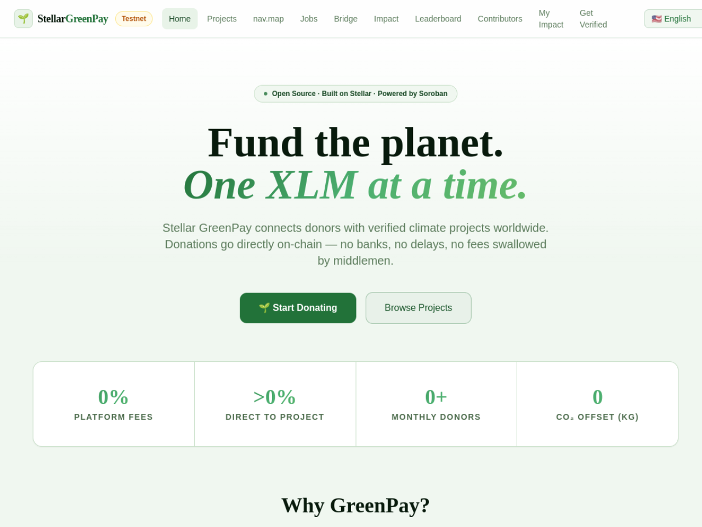

# Stellar GreenPay — Stellar Wave Research Submission

## Project Selected

- **Project:** Stellar GreenPay
- **Wave source:** [`Emmy123222/Stellar-GreenPay`](https://www.drips.network/wave/stellar/repos), listed as an approved repository in the Stellar Wave Program catalog
- **Category:** Social Impact / Payments (climate donations)
- **Repository:** https://github.com/Emmy123222/Stellar-GreenPay
- **Live application:** https://stellar-green-pay.vercel.app
- **Network:** Stellar Testnet

## Eligibility And Duplicate Check

Stellar GreenPay appears in the Drips catalog of repositories approved for the
Stellar Wave Program. Hub searches for `greenpay`, and adjacent terms
(`micropay`, `offer`, `stellopay`, `akkuea`, `boundless`, `safetrust`,
`routedock`, `rebalancer`), returned no GreenPay match when this research was
prepared — the closest hits are the unrelated StellarMicroPay (#97) and the
same maintainer's other projects — so GreenPay was not already listed on
Stellar Wave Hub. This work targets issue #323.

## What GreenPay Does

Stellar GreenPay is an open-source climate donation platform where donors send
XLM directly to verified environmental projects and every donation is recorded
on the Stellar blockchain through a Soroban smart contract. The platform takes
no cut: donations go straight to each project's registered wallet, while the
GreenPay contract maintains an independent, queryable record of what happened
— project totals, per-donor statistics, platform-wide XLM raised, total grams
of CO₂ offset, and donation count.

Each verified project is registered on-chain by the contract admin with an id,
name, wallet, and a `co2_per_xlm` factor estimating grams of CO₂ offset per
XLM donated. Donors call `donate` with the token, project id, amount, and an
optional message hash; the contract records the donation and updates both
project and global aggregates. Donors earn on-chain impact badges as their
cumulative giving crosses thresholds — Seedling (≥10 XLM), Tree (≥100), Forest
(≥500), and Earth Guardian (≥2,000). Admin rotation is a deliberate two-step
`propose_new_admin` / `accept_admin` flow to avoid accidental lockout, and a
`deactivate_project` call stops new donations to a project without erasing its
history.

The product around the contract is substantial: a Next.js/React/Tailwind
frontend with Freighter wallet connection, project browsing by category
(reforestation, solar, ocean, clean water, wildlife, carbon capture), a donor
leaderboard, and project update posts; a Node.js/Express API with a Postgres
schema covering donations, campaigns, milestones, donation matching, recurring
donations, webhook deliveries, and verification requests (see
`docs/openapi.yml` for the full surface, including on-chain project
registration via build/confirm XDR endpoints); and a browser extension with
store-ready assets. An `escrow-contract` with milestone-based release,
dispute freezing, and admin-rotation test snapshots sits alongside the main
GreenPay contract. Engineering hygiene is strong: CI runs the contract test
suite (including fuzz property tests with thousands of recorded snapshots) and
Gitleaks secret scanning on every push.

The deployment is testnet-only today, and the repository is explicit that
mainnet work (rotation of secrets, mainnet contract configuration) is on the
deployment checklist rather than done — an accurate limitation for a profile
of this project.

## On-Chain Verification

GreenPay deploys its own Soroban contract (rather than settling through a
shared asset contract), but the repository deliberately keeps the deployed
contract id out of source control: `CONTRACT_ID` is read from the environment
at runtime (`backend/src/services/stellar.js`), the README's env templates
ship it empty, and the deploy script prints the id at deploy time for the
operator to place into `.env`. No committed artifact on `main` records the
deployed testnet id, and I could not confirm a specific contract id from
public sources alone. Rather than state an unverifiable id, this profile
verifies the platform's Stellar integration through the deployed application
and code:

- **Live deployment:** https://stellar-green-pay.vercel.app responds and
  serves the donation product ("Donate to climate projects using Stellar USDC
  and XLM. 100% goes directly, on-chain and transparent."), including the
  on-chain badge tiers and zero-platform-fee claims that map directly to the
  contract's badge logic.
- **Testnet configuration:** the backend Stellar service defaults to
  `https://horizon-testnet.stellar.org` and
  `https://soroban-testnet.stellar.org`, and the contract client wires
  `CONTRACT_ID` into Horizon/Soroban event queries filtered by contract id —
  donations, CO₂ offsets, and badge data are read back from the chain.
- **Contract source:** `contracts/greenpay-contract/src/lib.rs` implements the
  documented `donate`, `register_project`, badge, and admin-rotation logic,
  with `contracts/greenpay-contract/README.md` documenting each function and
  `scripts/deploy-contract.sh` showing the exact testnet deploy flow.

If the maintainers publish the deployed testnet contract id (e.g. in a
deployment record or the app's network panel), the profile can be updated
with a Stellar Expert link as further evidence.

## Screenshots

Included in this directory:

### Live application home (stellar-green-pay.vercel.app)

### Browser extension store screenshot (from the repository)

Both images are attached to the Hub submission as research images.

## Suggested Hub Submission

- **Name:** Stellar GreenPay
- **Category:** Other (climate finance / donations)
- **Network:** Testnet
- **Tags:** `soroban, donations, climate, xlm, impact-badges, freighter, transparency, open-source, stellar-wave`
- **Website:** https://stellar-green-pay.vercel.app
- **GitHub repository:** https://github.com/Emmy123222/Stellar-GreenPay
- **Soroban Contract ID:** _(not published in the repository; contract id is
  environment-configured by design)_
- **Stellar Account ID:** _(project wallets are registered on-chain per
  project; no single platform account is published)_

## Hub Submission Confirmed

- **Hub project ID:** `136`
- **Hub slug:** `stellar-greenpay-1790375736708`
- **Submission status:** `submitted` (awaiting administrator review)
- **Submitted network:** `Testnet`
- **Research images:** 2 uploaded and attached to the Hub record
  ([app home](https://dlwcywvybsedgmcggmjn.supabase.co/storage/v1/object/public/research-images/85/1790375722060-wfk5mr.png),
  [extension](https://dlwcywvybsedgmcggmjn.supabase.co/storage/v1/object/public/research-images/85/1790375722385-n583tu.png))
- **Submitted by:** Syringe7 (contributor #85), for issue #323

## Sources

1. [Drips Stellar Wave repository catalog](https://www.drips.network/wave/stellar/repos) — Wave approval listing
2. [Stellar GreenPay repository](https://github.com/Emmy123222/Stellar-GreenPay) — README (product scope, features, structure)
3. [greenpay-contract README](https://github.com/Emmy123222/Stellar-GreenPay/blob/main/contracts/greenpay-contract/README.md) — contract function reference, badge tiers, admin rotation
4. [backend/src/services/stellar.js](https://github.com/Emmy123222/Stellar-GreenPay/blob/main/backend/src/services/stellar.js) — testnet Horizon/Soroban defaults, CONTRACT_ID wiring
5. [docs/openapi.yml](https://github.com/Emmy123222/Stellar-GreenPay/blob/main/docs/openapi.yml) — full API surface
6. [Live application](https://stellar-green-pay.vercel.app) — deployed product claims and UI
7. [Stellar Wave Hub search](https://usestellarwavehub.vercel.app) — duplicate check (zero GreenPay matches)
