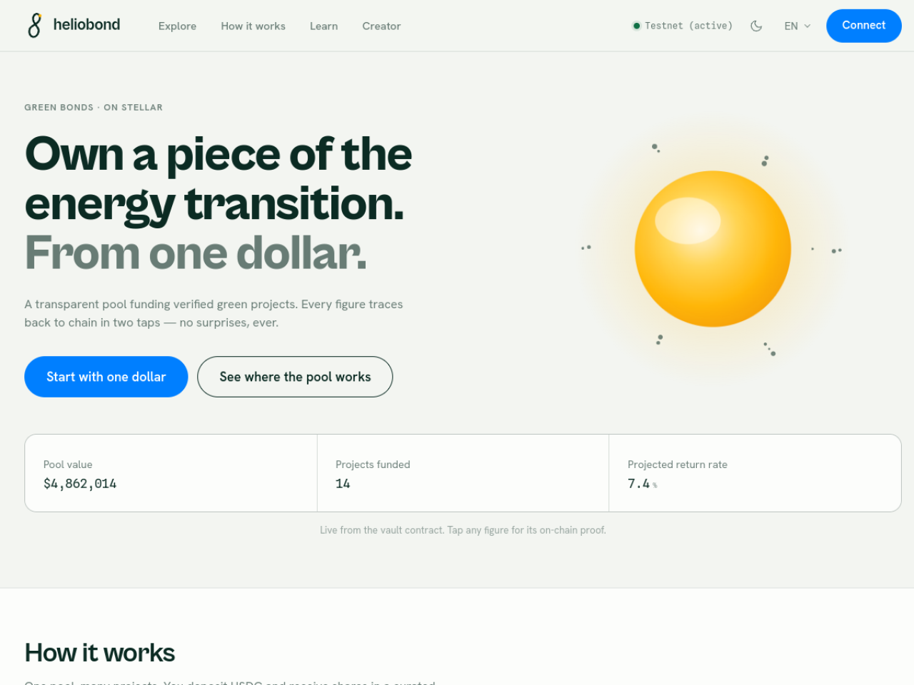
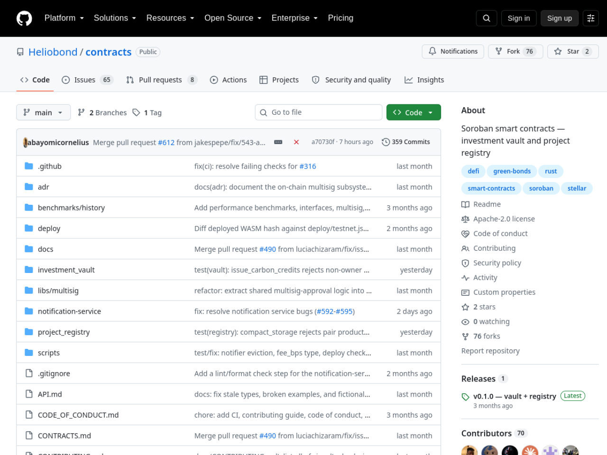

# Heliobond — Stellar Wave Research Submission

## Project Selected

- **Project:** Heliobond
- **Wave source:** [`Heliobond/frontend`](https://www.drips.network/wave/users/04546302-c502-4765-88f0-b373daab41a4), listed in the Stellar Wave Program directory on Drips (with companion org repos `Heliobond/contracts` and `Heliobond/backend`)
- **Category:** DeFi / RWA (green bonds)
- **Repositories:**
  - Soroban contracts: https://github.com/Heliobond/contracts
  - Investor frontend: https://github.com/Heliobond/frontend
  - Backend (indexer/API): https://github.com/Heliobond/backend
- **Live application:** https://heliobond.vercel.app
- **Network:** Stellar Testnet (target; deployment record present but ids not yet filled)

## Eligibility And Duplicate Check

Heliobond appears in the Stellar Wave Program directory on Drips. A Hub
search for `heliobond` returned zero matches when this research was prepared,
so it was not already listed on Stellar Wave Hub.

## What Heliobond Does

Heliobond is a green-bond platform on Stellar — "sunlight made financial" —
that opens green investing to everyone from a €5 first-timer to a €5M
institution. Investors deposit into a transparent pool funding verified green
projects; every figure in the app traces back to chain "in two taps." The
platform manages the full lifecycle from project registration through
investor deposits and capital disbursement.

The on-chain core is two Soroban contracts (Rust, Stellar CLI 26.1.0,
`wasm32v1-none` target): a **ProjectRegistry** storing project metadata with
oracle-updated impact scores, and an **InvestmentVault** — an SEP-41 token
vault that accepts USDC and mints HBS shares to investors. The contracts
carry a CI suite with test snapshots covering deposit/withdraw edge cases
(including a test that withdrawal fails when all USDC is deployed into
projects), benchmarks history, ADR records, a deploy pipeline with a WASM
hash verification script, and a scripted end-to-end walkthrough (whitelist →
create project → deposit → fund → certify). The deployment configuration
file (`deploy/testnet.json`) with dedicated fields for both contract ids and
WASM hashes exists but is not yet filled — the contracts are built and
tested, deployment pending.

The investor frontend is unusually polished: Next.js 16 / React 19 in strict
TypeScript on bun, with a real Stellar multi-wallet connection (Freighter,
xBull, Albedo, Lobstr, Hana, WalletConnect) on testnet, a live WebGL "Helio"
via react-three-fiber, first-class dark theme, English/French i18n, and a
design-token system driven by a brand handoff. Vault math flows through a
client structured for real Soroban `convert_to_shares` / `deposit` /
`withdraw` calls, with an honest demo mode when no contract id is configured
— the README explicitly documents which paths are simulated. The org also
maintains a backend (Stellar indexer and REST endpoints) and community
health files.

## On-Chain Verification

- **Live deployment (verified):** https://heliobond.vercel.app serves the
  investor app ("Green bonds · on Stellar — Own a piece of the energy
  transition. From one dollar.").
- **Contract source (verified):** the two-contract Soroban workspace
  implements the documented registry and vault (SEP-41, USDC in / HBS
  shares out) with CI and deployment tooling pinned to Stellar CLI 26.1.0.
- **Deployment (pending, per project's own record):** `deploy/testnet.json`
  contains dedicated fields for `project_registry`, `investment_vault`, and
  both WASM hashes — currently empty strings. The frontend runs the vault in
  documented demo mode until an id is configured. No contract id is asserted
  in this profile, matching the project's own deployment state.

## Screenshots

Included in this directory:

### Live investor app (heliobond.vercel.app)

### Contracts repository on GitHub

Both images are attached to the Hub submission as research images.

## Suggested Hub Submission

- **Name:** Heliobond
- **Category:** DeFi
- **Network:** Testnet
- **Tags:** `soroban, green-bonds, rwa, investment-vault, sep-41, project-registry, nextjs, i18n, stellar-wave`
- **Website:** https://heliobond.vercel.app
- **GitHub repository:** https://github.com/Heliobond/contracts
- **Soroban Contract ID:** _(none yet — deployment record exists with ids pending; documented rather than asserted)_
- **Stellar Account ID:** _(none published)_

## Hub Submission Confirmed

- **Hub project ID:** `145`
- **Hub slug:** `heliobond`
- **Submission status:** `submitted` (awaiting administrator review)
- **Submitted network:** `Testnet`
- **Research images:** 2 uploaded and attached to the Hub record
  ([frontend](https://dlwcywvybsedgmcggmjn.supabase.co/storage/v1/object/public/research-images/85/1790383653231-gct85t.png),
  [contracts](https://dlwcywvybsedgmcggmjn.supabase.co/storage/v1/object/public/research-images/85/1790383653601-6jgfi1.png))
- **Submitted by:** Syringe7 (contributor #85)

## Sources

1. [Drips Stellar Wave directory](https://www.drips.network/wave/users/04546302-c502-4765-88f0-b373daab41a4) — Heliobond Wave listing
2. [Heliobond/contracts](https://github.com/Heliobond/contracts) — README (two-contract architecture), DEPLOYMENT.md, deploy/testnet.json
3. [Heliobond/frontend](https://github.com/Heliobond/frontend) — README (stack, wallet wiring, demo-mode honesty), live app
4. [Heliobond/backend](https://github.com/Heliobond/backend) — Stellar indexer and REST endpoints
5. [Live deployment](https://heliobond.vercel.app) — verified serving the investor app
6. [Stellar Wave Hub search](https://usestellarwavehub.vercel.app) — duplicate check (zero Heliobond matches)
