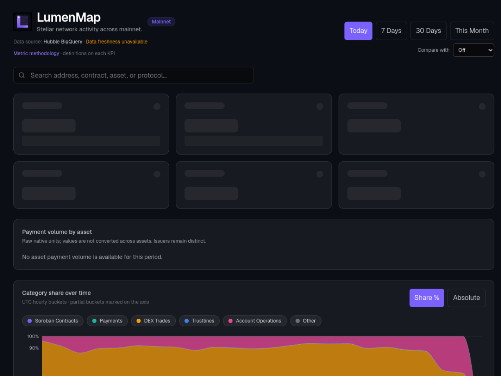
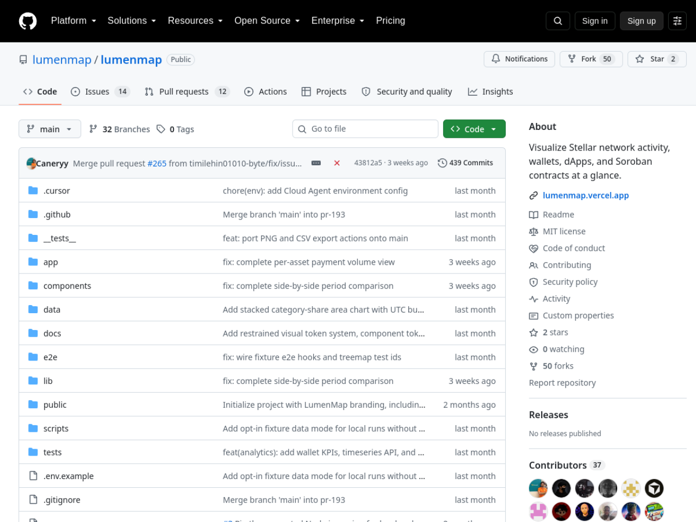

# LumenMap — Stellar Wave Research Submission

## Project Selected

- **Project:** LumenMap
- **Wave source:** [`lumenmap/lumenmap`](https://www.drips.network/wave/users/04546302-c502-4765-88f0-b373daab41a4), approved in the Stellar Wave Program (Drips assignment with Wave program ID `fdc01c95-…`, repo issues carry the `Stellar Wave` label)
- **Category:** Infrastructure (network analytics / explorer)
- **Repository:** https://github.com/lumenmap/lumenmap
- **Live application:** https://lumenmap.vercel.app
- **Network:** Stellar Mainnet (read-only analytics)

## Eligibility And Duplicate Check

LumenMap is a Stellar Wave Program project (Wave assignment recorded on
Drips, `Stellar Wave` label on its tracked issues) and was absent from
Stellar Wave Hub when this research was prepared — a Hub search for
`lumenmap` returned zero matches.

## What LumenMap Does

LumenMap is a Stellar network activity dashboard. Where block explorers list
transactions one by one, LumenMap answers a different question: what is the
network doing as a whole? It shows operation activity levels, how activity
splits across payments, DEX, Soroban, and other operation types, which
accounts and Soroban contracts drive the most activity, and the top dApps and
protocols — with drill-down from broad categories to specific wallets and
contracts.

The product's center is a hierarchical D3 treemap (squarified layout with
drill-down and breadcrumbs): tile size is share of operation activity, color
is category, and two views switch between Operation Types and Accounts &
Contracts. Period filters cover 1 day, 7 days, 30 days, and the calendar
month; KPI cards surface total operations, Soroban share, top category, and
active contracts (top-200 observed); a category-share area chart shows
absolute or percentage evolution; and an entity registry layers known names
onto raw addresses using `data/entities.json`, Stellar Expert, and Hubble
`home_domain` metadata.

Data comes from Stellar's official **Hubble** analytics dataset
(`crypto-stellar.crypto_stellar_dbt`) on BigQuery — not a scraped explorer —
with four live queries today: operations by type, top accounts per operation
type, top invoked Soroban contracts, and Soroban function counts. Responses
are served through a documented `GET /api/v1/activity` endpoint with a
15-minute in-process cache, and the payload carries metric provenance:
methodology version, source tables, aggregation dimensions, and network
coverage.

Two aspects of the engineering discipline stand out. First, a **canonical
metric methodology** document (versioned 1.0.0) defines every metric
authoritatively — operation count is available today, while transaction
count, active accounts, and payment volume are explicitly marked unavailable,
and the README warns against comparing LumenMap's operation counts to
explorers' transaction counts. Second, **honest data sourcing**: a fixture
mode serves checked-in sample data for local onboarding and e2e tests, but
setting it in production fails closed, so the dashboard can never quietly
show fake data; the live API also flags partial periods rather than
presenting in-progress windows as final. The codebase is Next.js 16 /
TypeScript with unit tests across chart math, data-source handling, and URL
state, plus Playwright e2e and visual test suites, MIT licensed.

LumenMap deploys no smart contracts of its own — it is read-only network
observability infrastructure, built on the Wave ecosystem's official data
pipeline, complementing explorers rather than competing with them.

## On-Chain Verification

LumenMap is an analytics layer over mainnet data, so verification centers on
the deployed app and its declared data pipeline:

- **Live deployment:** https://lumenmap.vercel.app serves the mainnet
  dashboard ("Stellar network activity across mainnet") with the treemap,
  KPI cards, period filters, and category charts.
- **Official data source:** the app queries the Stellar Development
  Foundation's public Hubble BigQuery dataset
  (`crypto-stellar.crypto_stellar_dbt`), as configured in
  `lib/hubble/activity.ts` and documented in `docs/metric-methodology.md` —
  the same dataset SDF publishes for ecosystem analytics.
- **No self-issued contracts or accounts:** the project correctly operates no
  Soroban contracts and no platform accounts; its subject matter is other
  projects' on-chain activity. The Hub profile therefore carries no contract
  or account ID by design, which the submission notes.

## Screenshots

Included in this directory:

### Live dashboard (lumenmap.vercel.app)

### GitHub repository page

Both images are attached to the Hub submission as research images.

## Suggested Hub Submission

- **Name:** LumenMap
- **Category:** Infrastructure
- **Network:** Mainnet (read-only analytics over mainnet data)
- **Tags:** `analytics, hubble, bigquery, treemap, soroban, dashboard, explorer, infrastructure, stellar-wave`
- **Website:** https://lumenmap.vercel.app
- **GitHub repository:** https://github.com/lumenmap/lumenmap
- **Soroban Contract ID:** _(none — read-only analytics; the project deploys no contracts)_
- **Stellar Account ID:** _(none — no platform accounts operated)_

## Hub Submission Confirmed

- **Hub project ID:** `139`
- **Hub slug:** `lumenmap`
- **Submission status:** `submitted` (awaiting administrator review)
- **Submitted network:** `Testnet` (Hub requires testnet/mainnet enum; profile text documents mainnet read-only analytics)
- **Research images:** 2 uploaded and attached to the Hub record
  ([dashboard](https://dlwcywvybsedgmcggmjn.supabase.co/storage/v1/object/public/research-images/85/1790379549594-d86tu3.png),
  [repo](https://dlwcywvybsedgmcggmjn.supabase.co/storage/v1/object/public/research-images/85/1790379549972-hbd6s6.png))
- **Submitted by:** Syringe7 (contributor #85)

## Sources

1. [Drips Stellar Wave assignment](https://www.drips.network/wave/users/04546302-c502-4765-88f0-b373daab41a4) — lumenmap/lumenmap Wave program record
2. [LumenMap repository](https://github.com/lumenmap/lumenmap) — README (product scope, architecture, roadmap, honesty policies)
3. [docs/metric-methodology.md](https://github.com/lumenmap/lumenmap/blob/main/docs/metric-methodology.md) — canonical metric definitions, Hubble sourcing, freshness caveats
4. [Live deployment](https://lumenmap.vercel.app) — verified serving the mainnet dashboard
5. [lumenmap/lumenmap#64](https://github.com/lumenmap/lumenmap/issues/64) — `Stellar Wave` labeled issue confirming program participation
6. [Stellar Hubble documentation](https://developers.stellar.org/docs/data/analytics/hubble) — SDF's official analytics dataset used by the project
7. [Stellar Wave Hub search](https://usestellarwavehub.vercel.app) — duplicate check (zero LumenMap matches)
