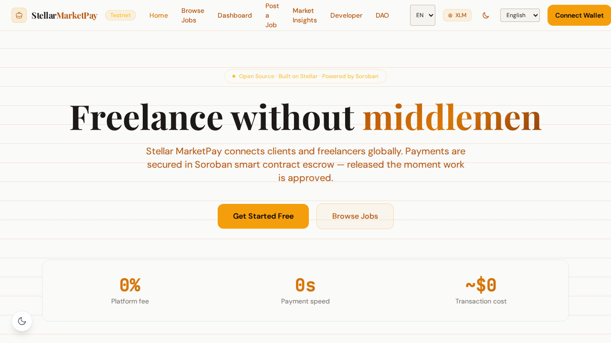
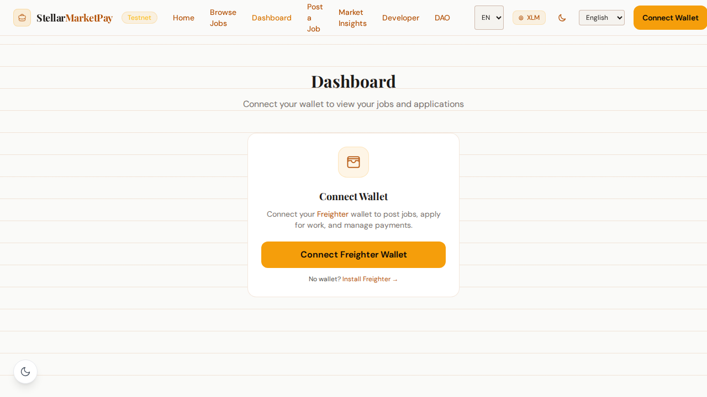
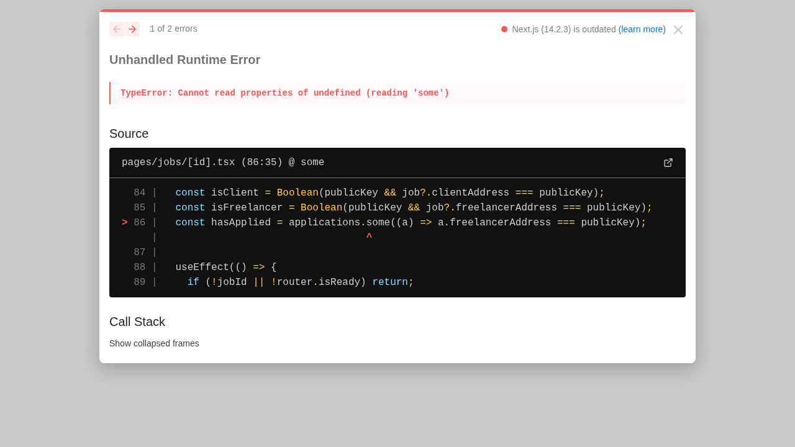

# Stellar MarketPay — Stellar Wave Research Submission

## Project Selected

- **Project:** Stellar MarketPay
- **Wave source:** [`Emmy123222/Stellar-MarketPay-`](https://www.drips.network/wave/stellar/repos), listed as an approved repository under the Stellar Agentic Hackathon cohort of the Stellar Wave Program
- **Category:** Marketplace
- **Repository:** https://github.com/Emmy123222/Stellar-MarketPay-
- **Live application:** https://stellar-market-pay.vercel.app
- **Network:** Stellar Testnet

## Eligibility And Duplicate Check

Stellar MarketPay appears in the Drips catalog of repositories approved for the
Stellar Wave Program (2x points cohort, "Stellar Agentic Hackathon"). A Hub
search for `marketpay` / `market` / `pay` returned no matching projects when
this research was prepared, so it was not already listed on Stellar Wave Hub.

## What MarketPay Does

Stellar MarketPay is a decentralised freelance marketplace where clients post
jobs and freelancers are paid from funds locked in a Soroban smart-contract
escrow, so payment does not depend on either party trusting the other or on a
platform holding money. A client posts a job with an XLM or USDC budget, the
amount is locked on-chain, a freelancer is accepted and delivers, and the
contract releases payment only when the client approves the work. Refund and
timeout paths return funds when a job is cancelled or expires, so locked money
always has a defined exit.

The deployment is testnet. A Rust Soroban escrow contract holds the core state
machine: `create_escrow` locks funds, `start_work` marks delivery,
`release_escrow` pays the freelancer, and `refund_escrow` returns funds, with a
100 bps platform fee. Contract lifecycle transactions from July 2026 are
verifiable on stellar.expert. The product layer is a Next.js frontend with
Freighter wallet connection and a Node/Express API backed by PostgreSQL and
Redis, exposing REST and GraphQL endpoints and WebSocket notifications.
Authentication is passwordless via the Stellar SEP-0010 wallet challenge
standard: the server issues a challenge transaction, the wallet signs it, and
the API issues JWT access and refresh cookies.

Disputes follow a three-step arbitration process. Either party freezes the
escrow with an on-chain `raise_dispute` call, evidence files are pinned to IPFS
with their CIDs anchored on-chain as an append-only audit trail, and
arbitrators selected from a DAO-governed registry rule via `resolve_dispute`,
which enforces the payout split and settles a dispute bond on-chain. Completed
jobs feed a rating and reputation system, and search and recommendation
surfaces use that trust data. Engineering quality is unusually strong for a
community project: the escrow invariants (locked-fund consistency, no double
release, client-only authorization) have Certora formal-verification
specifications, and CI runs backend tests, Playwright end-to-end and
accessibility suites, CodeQL, and dependency audits.

## On-Chain Verification

The project's contract deployment guide
([docs/contract-deployment.md](https://github.com/Emmy123222/Stellar-MarketPay-/blob/main/docs/contract-deployment.md))
identifies the Testnet Soroban escrow contract:

- **Escrow contract (Testnet):**
  `CBFJNX67NYYRZPLH4YYT77ZUULRJ5NI2LPEYRRLFHBTEACZOZUUYLOGG`
- **Admin / treasury account:**
  `GAUC7VCPFCQQBMHMOH3NPRUSOT2RBXLJNV433JMAXUPFYKU2MCO7CHL4` — confirmed to
  exist on Testnet via the Horizon accounts endpoint.

The contract ID resolves in the [Stellar Expert Testnet
explorer](https://stellar.expert/explorer/testnet/contract/CBFJNX67NYYRZPLH4YYT77ZUULRJ5NI2LPEYRRLFHBTEACZOZUUYLOGG).
The deployment document lists four lifecycle transactions, and each was
independently confirmed successful through the Testnet Horizon API:

| Function | Tx hash | Horizon result |
|----------|---------|----------------|
| Initialization | `51b84452dc148912ec2fecf317c5ac9b3a274c69c98734e6836c1023cad30f08` | successful, ledger 3863812, 2026-07-29 |
| `create_escrow` | `f262cd2c7b501e52cf79535dada3a846013fdf74569ae7fc31bc5845394768dd` | successful, ledger 3863846 |
| `start_work` → `release_escrow` | `d4cd6eb65775916f9a38aafa256d915836973fc6d298c854fdd93ba9b372e123` | successful, ledger 3863857 |
| `refund_escrow` | `a0faf221f15a1a0ca3f7f5c0bfcfebe90d7cc64bc7b359b475b7f40777805940` | successful, ledger 3863866 |

The initialization transaction envelope (fetched from Horizon and decoded)
embeds the contract's 32-byte hex id, tying the deployed contract to the
documented id.

## Screenshots

Captured from the project's own Playwright end-to-end snapshot suite
(`frontend/e2e/snapshots/`) and included in this directory:

### Landing page

### Dashboard (job listing)

### Job detail

The same three images are attached to the Hub submission as research images.

## Suggested Hub Submission

- **Name:** Stellar MarketPay
- **Category:** Marketplace
- **Network:** Testnet
- **Tags:** `marketplace, freelance, escrow, soroban, sep-10, freighter, usdc, ipfs, dispute-resolution, stellar-wave`
- **Website:** https://stellar-market-pay.vercel.app
- **GitHub repository:** https://github.com/Emmy123222/Stellar-MarketPay-
- **Soroban Contract ID:** `CBFJNX67NYYRZPLH4YYT77ZUULRJ5NI2LPEYRRLFHBTEACZOZUUYLOGG`

## Submission Confirmed

- **Hub project ID:** `134`
- **Hub slug:** `stellar-marketpay-1790288284638`
- **Submission status:** `submitted` (awaiting administrator review)
- **Research images:** 3 uploaded and attached to the Hub record.

## Sources

1. [Drips Stellar Wave repository catalog](https://www.drips.network/wave/stellar/repos)
2. [Stellar MarketPay repository](https://github.com/Emmy123222/Stellar-MarketPay-) — README, ROADMAP, and docs
3. [Contract deployment guide](https://github.com/Emmy123222/Stellar-MarketPay-/blob/main/docs/contract-deployment.md) — deployed contract id and test transactions
4. [Architecture reference](https://github.com/Emmy123222/Stellar-MarketPay-/blob/main/docs/architecture.md) — system components and SEP-10 auth flow
5. [Dispute resolution guide](https://github.com/Emmy123222/Stellar-MarketPay-/blob/main/docs/dispute-resolution.md) — arbitration, IPFS evidence anchoring, DAO arbitrator registry
6. [Contract formal verification](https://github.com/Emmy123222/Stellar-MarketPay-/blob/main/contracts/README.md) — Certora CVL invariants
7. [Escrow contract on Stellar Expert (testnet)](https://stellar.expert/explorer/testnet/contract/CBFJNX67NYYRZPLH4YYT77ZUULRJ5NI2LPEYRRLFHBTEACZOZUUYLOGG)
8. [Initialization transaction on Horizon](https://horizon-testnet.stellar.org/transactions/51b84452dc148912ec2fecf317c5ac9b3a274c69c98734e6836c1023cad30f08)
