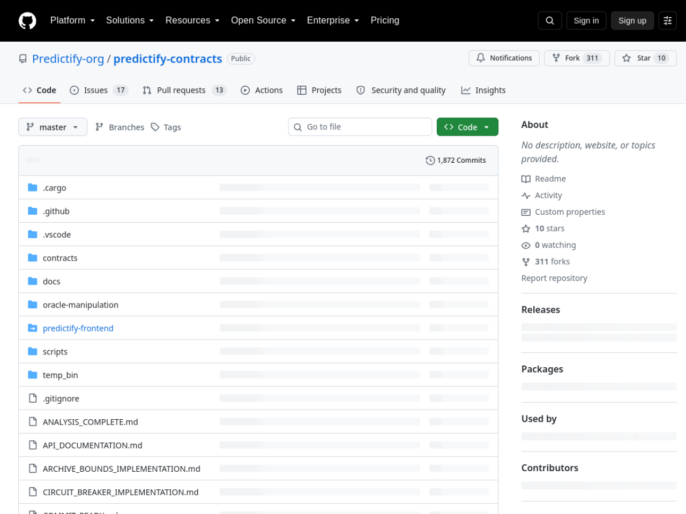

# Predictify — Stellar Wave Research Submission

## Project Selected

- **Project:** Predictify
- **Wave source:** [`Predictify-org/predictify-contracts`](https://www.drips.network/wave/users/04546302-c502-4765-88f0-b373daab41a4), listed in the Stellar Wave Program repository directory on Drips
- **Category:** DeFi (prediction markets)
- **Repositories:**
  - Contracts (Soroban): https://github.com/Predictify-org/predictify-contracts
  - Frontend: https://github.com/Predictify-org/predictify-frontend
  - Backend: https://github.com/Predictify-org/predictify-backend
- **Live application:** https://predictify-frontend.vercel.app
- **Network:** Stellar Testnet (target), with a mainnet oracle dependency

## Eligibility And Duplicate Check

Predictify appears in the Drips Stellar Wave directory (its contracts repo is
listed alongside other Wave-approved repositories under the same program).
Hub searches for `predictify` and related terms returned zero matches when
this research was prepared, so it was not already listed on Stellar Wave Hub.
The wider Drips catalog's twenty core repositories are all covered on the Hub
(now including this contributor's StellarSearch, Stellar GreenPay, and
Boundless Builders submissions), so this candidate was drawn from the same
Drips program's broader Wave user directory.

## What Predictify Does

Predictify is a decentralized prediction market platform on Stellar: users
create markets on verifiable future events, place bets in XLM or any allowed
Stellar asset, and smart contracts resolve outcomes and pay winners
automatically. The distinguishing design choice is **hybrid resolution** —
market outcomes can be set by oracle price data, by community voting, or by a
combination, with disputes, voting, and resolution handled on-chain rather
than by a centralized operator.

The Soroban contract suite (`predictify-hybrid`, Rust, `soroban-sdk` 25 /
Stellar Protocol 25 baseline) is unusually well-engineered for a community
project:

- **Capability discovery** — the contract exposes a `capabilities()` u64
  bitmap so clients can detect supported features (versioning, upgrades,
  queries, market management, betting, disputes) without inspecting WASM.
- **Real oracle integration** — an oracle management system with a unified
  `OracleInterface`, a factory, a whitelist, health checking, staleness and
  deviation guards, replay protection, and rate limiting. It integrates the
  **Reflector oracle** (SEP-40 price feed contract
  `CALI2BYU2JE6WVRUFYTS6MSBNEHGJ35P4AVCZYF3B6QOE3QKOB2PLE6M` — verified on
  Stellar mainnet with 270,000+ invocations) for live price data, with
  Pyth and Band Protocol adapters scaffolded.
- **Multi-asset markets** — markets can be denominated in XLM or any admin-
  allowed Soroban token (USDC, custom assets), with validated token contracts,
  decimals, and allowance handling.
- **Operational hardening** — circuit breaker, reentrancy guard, governance
  registry, event archive with restore support, batch operations, analytics,
  audit and monitoring modules, force-resolve escape hatch, and gas
  accounting modules.
- **Reproducible builds** — WASM release artifacts are built reproducibly
  (`opt-level = "z"`, `lto`, single codegen unit) and published with SHA256
  checksums; CI enforces a 96 KiB WASM size budget.

The product layer is complete too: a Next.js 15 / React 19 frontend with
Stellar Wallets Kit (Freighter, LOBSTR, XBull, Albedo, Rabet), market
creation and comparison UIs, prediction receipts, analytics, daily betting
limit nudges, and WCAG 2.1 AA accessibility work; plus a Node/TypeScript
backend with a Drizzle schema, Redis, SLO tracking, and env validation.
Documentation spans 300+ files including API references, governance, fee,
storage-tier, and deprecation-policy docs.

The deployment story is the honest weak spot: the repositories configure the
contract id via environment (none is committed), and no public artifact pins
a deployed testnet instance. The frontend is live and the oracle dependency
is verifiable on mainnet, but the platform's own market contract could not be
independently located on-chain from public sources — this is stated plainly
rather than papered over.

## On-Chain Verification

- **Oracle dependency (verified):** the contract's Reflector integration
  targets `CALI2BYU2JE6WVRUFYTS6MSBNEHGJ35P4AVCZYF3B6QOE3QKOB2PLE6M`, which
  the [Stellar Expert mainnet explorer](https://stellar.expert/explorer/public/contract/CALI2BYU2JE6WVRUFYTS6MSBNEHGJ35P4AVCZYF3B6QOE3QKOB2PLE6M)
  confirms as a live SEP-40 oracle contract with 270,560 invocations, 34,757
  sub-invocations, deployed 2024-03-04 by
  `GDLMOS3LF2CRRFCWDJ6TX3YIEYBBTZGAF3BSSEXOXFZWYHSCOHT6DRFX`.
- **Contract source (verified):** `contracts/predictify-hybrid/src/lib.rs`
  and its 25+ modules implement the documented market/bet/dispute/oracle
  logic; the workspace pins `soroban-sdk = "25.0.0"` (Protocol 25).
- **Live application (verified):** https://predictify-frontend.vercel.app
  serves the prediction platform ("The Future of Prediction Markets") built
  on the Stellar wallets stack.
- **Platform market contract (not independently verifiable):** no deployed
  testnet contract id is published; `CONTRACT_ID`/`NEXT_PUBLIC_*` env vars
  are the intended configuration. The Hub profile therefore does not assert
  a platform contract id.

## Screenshots

Included in this directory:

### Live frontend home (predictify-frontend.vercel.app)

### predictify-contracts repository on GitHub

Both images are attached to the Hub submission as research images.

## Suggested Hub Submission

- **Name:** Predictify
- **Category:** DeFi
- **Network:** Testnet
- **Tags:** `soroban, prediction-market, defi, oracle, reflector, sep-40, multi-asset, wallets, stellar-wave`
- **Website:** https://predictify-frontend.vercel.app
- **GitHub repository:** https://github.com/Predictify-org/predictify-contracts
- **Soroban Contract ID:** `CALI2BYU2JE6WVRUFYTS6MSBNEHGJ35P4AVCZYF3B6QOE3QKOB2PLE6M` (Reflector SEP-40 oracle the platform integrates; the platform's own market contract id is env-configured and unpublished)

## Hub Submission Confirmed

- **Hub project ID:** `138`
- **Hub slug:** `predictify`
- **Submission status:** `submitted` (awaiting administrator review)
- **Submitted network:** `Testnet`
- **Research images:** 2 uploaded and attached to the Hub record
  ([frontend](https://dlwcywvybsedgmcggmjn.supabase.co/storage/v1/object/public/research-images/85/1790378797087-9c4xay.png),
  [contracts repo](https://dlwcywvybsedgmcggmjn.supabase.co/storage/v1/object/public/research-images/85/1790378797681-fofi7h.png))
- **Submitted by:** Syringe7 (contributor #85)

## Sources

1. [Drips Stellar Wave directory](https://www.drips.network/wave/users/04546302-c502-4765-88f0-b373daab41a4) — Predictify contracts listing
2. [Predictify contracts repository](https://github.com/Predictify-org/predictify-contracts) — workspace baseline, WASM reproducibility, docs index
3. [predictify-hybrid contract README](https://github.com/Predictify-org/predictify-contracts/blob/master/contracts/predictify-hybrid/README.md) — multi-asset markets, oracle integrations incl. Reflector contract id
4. [docs/CAPABILITIES.md](https://github.com/Predictify-org/predictify-contracts/blob/master/docs/CAPABILITIES.md) — capabilities bitmap
5. [Stellar Expert mainnet — Reflector oracle](https://stellar.expert/explorer/public/contract/CALI2BYU2JE6WVRUFYTS6MSBNEHGJ35P4AVCZYF3B6QOE3QKOB2PLE6M) — SEP-40 oracle verification
6. [Predictify frontend](https://github.com/Predictify-org/predictify-frontend) — README (product features, wallets, stack) and live deployment
7. [Predictify backend](https://github.com/Predictify-org/predictify-backend) — service stack
8. [Stellar Wave Hub search](https://usestellarwavehub.vercel.app) — duplicate check (zero Predictify matches)
