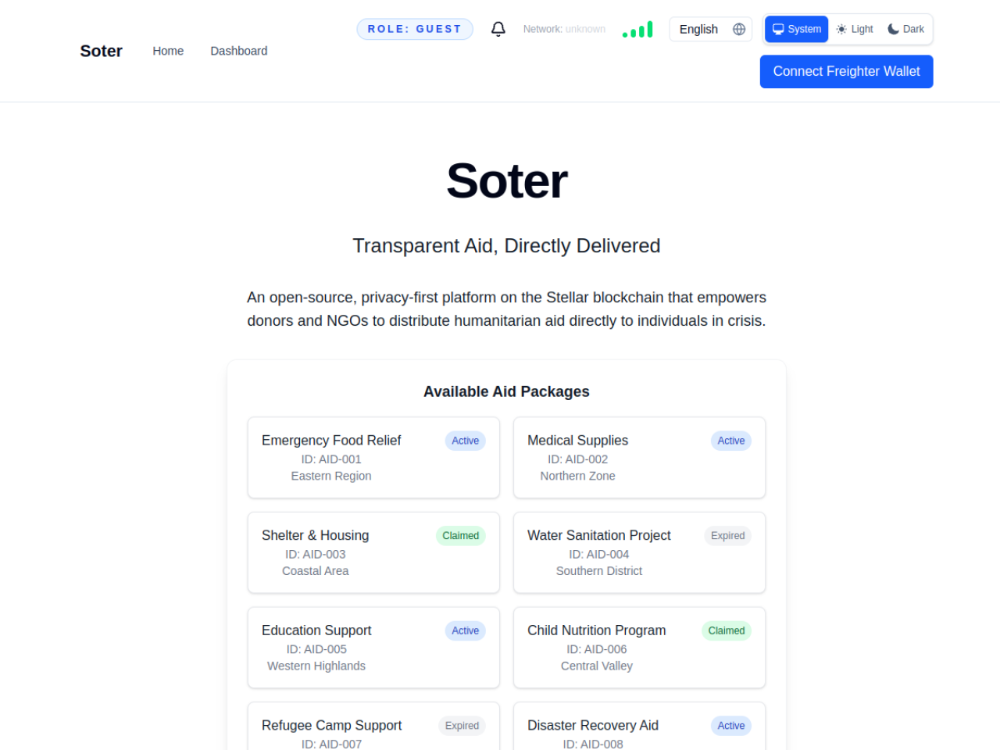
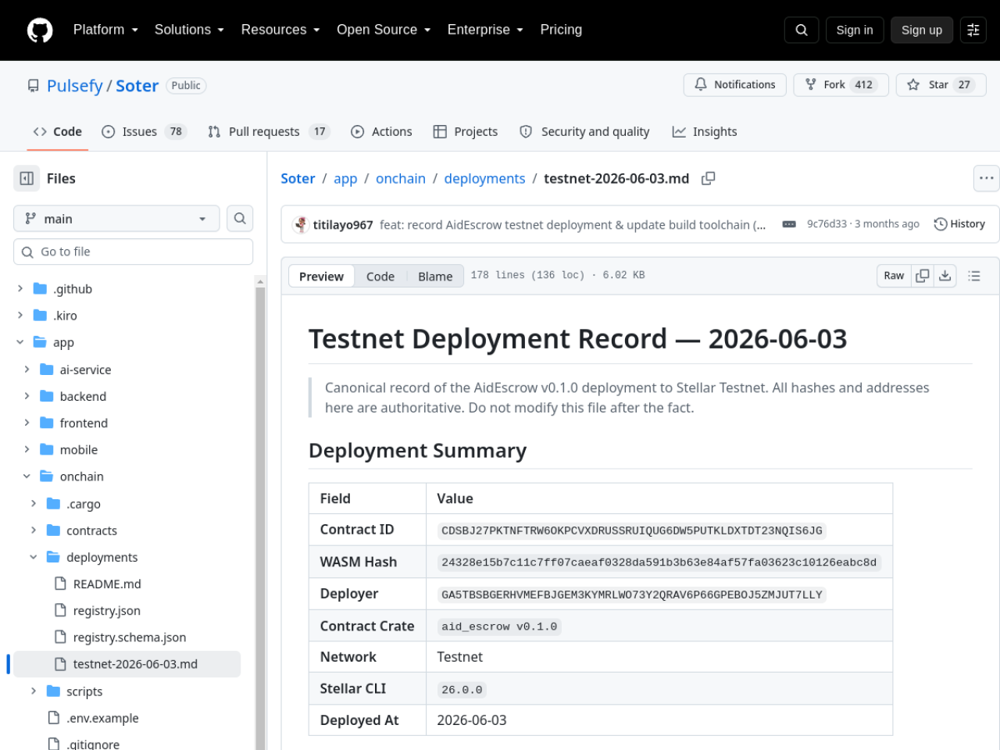

# Soter — Stellar Wave Research Submission

## Project Selected

- **Project:** Soter
- **Wave source:** [`Pulsefy/Soter`](https://www.drips.network/wave/users/04546302-c502-4765-88f0-b373daab41a4), listed in the Stellar Wave Program directory on Drips
- **Category:** Payments (humanitarian aid disbursement)
- **Repository:** https://github.com/Pulsefy/Soter
- **Live application:** https://realsoter.vercel.app
- **Network:** Stellar Testnet

## Eligibility And Duplicate Check

Soter appears in the Stellar Wave Program directory on Drips. A Hub search
for `soter` returned zero matches when this research was prepared, so it was
not already listed on Stellar Wave Hub.

## What Soter Does

Soter is a humanitarian aid distribution platform built on Stellar: it
combines on-chain escrow and auditable contract events with off-chain
verification and field-ready client apps, so donors and NGOs can distribute
aid directly to individuals in crisis without intermediate skimming. Funds
are locked in an on-chain escrow for specific recipients; recipients claim
packages directly; admins can disburse, revoke, or refund; and every state
transition emits an indexer-friendly event.

The **AidEscrow** Soroban contract (Rust) enforces clear invariants: a pool
model where funds must be deposited via `fund()` before allocation, a
solvency rule preventing package creation beyond locked funds, a package
state machine (`Created` → `Claimed`, or `Expired`/`Cancelled` →
`Refunded`), optional expiry time-bounds that block late claims, and admin
sovereignty over pause, configuration, and manual disbursement. Event design
is deliberate — stable topic identifiers in snake_case with compact payloads
and no PII, documented in a table covering funding, creation, claims,
disbursement, revocation, refunds, batch creation, expiry extension, and
surplus withdrawal — explicitly built so indexers and dashboards can filter
reliably.

Around the contract sits a full product suite: a NestJS backend (TypeScript,
Prisma) with role-based access, an on-chain adapter, observability hooks,
and a deployment-metadata module that tracks contract configuration; a
Next.js admin/donor dashboard with campaign review workflows and wallet
flows; an Expo mobile app for field operations (scan, view, submit/confirm
claims) with WalletConnect; and a FastAPI AI service performing OCR,
anonymization, and fraud checks for verification flows. Operational maturity
shows in the details: network guardrails against cross-network mismatches,
deterministic test modes for CI, health probes, and a canonical deployment
registry (`deployments/registry.json` with a JSON schema) plus a runbook and
verification scripts that check a deployed contract against its recorded
WASM hash.

## On-Chain Verification

Soter publishes a canonical testnet deployment record, and every claim in it
was independently confirmed:

- **AidEscrow contract (Testnet):**
  `CDSBJ27PKTNFTRW6OKPCVXDRUSSRUIQUG6DW5PUTKLDXTDT23NQIS6JG` — resolves in
  the [Stellar Expert Testnet explorer](https://stellar.expert/explorer/testnet/contract/CDSBJ27PKTNFTRW6OKPCVXDRUSSRUIQUG6DW5PUTKLDXTDT23NQIS6JG):
  created 2026-06-03, deployer
  `GA5TBSBGERHVMEFBJGEM3KYMRLWO73Y2QRAV6P66GPEBOJ5ZMJUT7LLY`, WASM hash
  `24328e15b7c11c7ff07caeaf0328da591b3b63e84af57fa03623c10126eabc8d` — all
  three values matching the repository's deployment record exactly.
- **Deployment transactions (verified on Horizon):**
  - WASM upload
    [`f61ca00143125d29f9932b5b50e499d9ab5dde8f2a849637a64d84cd1dcb9103`](https://horizon-testnet.stellar.org/transactions/f61ca00143125d29f9932b5b50e499d9ab5dde8f2a849637a64d84cd1dcb9103)
    — successful, ledger 2,900,297, 2026-06-03T18:55:07Z
  - Contract deploy
    [`292bf42f063310028456890e88861cd1650149ef0d4e66ba2a22ea5769964e64`](https://horizon-testnet.stellar.org/transactions/292bf42f063310028456890e88861cd1650149ef0d4e66ba2a22ea5769964e64)
    — successful, ledger 2,900,299, 2026-06-03T18:55:17Z
- **Live deployment (verified):** https://realsoter.vercel.app serves the
  donor/admin dashboard ("Transparent Aid, Directly Delivered") with
  role-based views and multi-language support.
- The single on-chain invocation count reflects the escrow being deployed
  and initialized; the platform's operational pilots run through the
  backend's adapter, and the deployment-metadata system is designed to track
  subsequent contract configuration.

## Screenshots

Included in this directory:

### Live frontend (realsoter.vercel.app)

### Canonical testnet deployment record

Both images are attached to the Hub submission as research images.

## Suggested Hub Submission

- **Name:** Soter
- **Category:** Payments
- **Network:** Testnet
- **Tags:** `soroban, escrow, humanitarian, aid, disbursement, indexer, nestjs, expo, ai-verification, stellar-wave`
- **Website:** https://realsoter.vercel.app
- **GitHub repository:** https://github.com/Pulsefy/Soter
- **Soroban Contract ID:** `CDSBJ27PKTNFTRW6OKPCVXDRUSSRUIQUG6DW5PUTKLDXTDT23NQIS6JG` (AidEscrow, Testnet)
- **Stellar Account ID:** `GA5TBSBGERHVMEFBJGEM3KYMRLWO73Y2QRAV6P66GPEBOJ5ZMJUT7LLY` (contract deployer)

## Hub Submission Confirmed

- **Hub project ID:** `143`
- **Hub slug:** `soter`
- **Submission status:** `submitted` (awaiting administrator review)
- **Submitted network:** `Testnet`
- **Research images:** 2 uploaded and attached to the Hub record
  ([frontend](https://dlwcywvybsedgmcggmjn.supabase.co/storage/v1/object/public/research-images/85/1790381550642-qch2wh.png),
  [deployment record](https://dlwcywvybsedgmcggmjn.supabase.co/storage/v1/object/public/research-images/85/1790381551068-eq5g94.png))
- **Submitted by:** Syringe7 (contributor #85)

## Sources

1. [Drips Stellar Wave directory](https://www.drips.network/wave/users/04546302-c502-4765-88f0-b373daab41a4) — Pulsefy/Soter Wave listing
2. [Pulsefy/Soter repository](https://github.com/Pulsefy/Soter) — README (features, architecture, tech stack)
3. [app/onchain/README.md](https://github.com/Pulsefy/Soter/blob/main/app/onchain/README.md) — AidEscrow contract, invariants, event schema, deployed contract id
4. [Deployment record testnet-2026-06-03.md](https://github.com/Pulsefy/Soter/blob/main/app/onchain/deployments/testnet-2026-06-03.md) — canonical deployment record
5. [Stellar Expert Testnet — AidEscrow](https://stellar.expert/explorer/testnet/contract/CDSBJ27PKTNFTRW6OKPCVXDRUSSRUIQUG6DW5PUTKLDXTDT23NQIS6JG) — contract verification
6. [Horizon Testnet transactions](https://horizon-testnet.stellar.org/transactions/292bf42f063310028456890e88861cd1650149ef0d4e66ba2a22ea5769964e64) — deployment tx confirmation
7. [Live deployment](https://realsoter.vercel.app) — verified serving the platform
8. [Stellar Wave Hub search](https://usestellarwavehub.vercel.app) — duplicate check (zero Soter matches)
