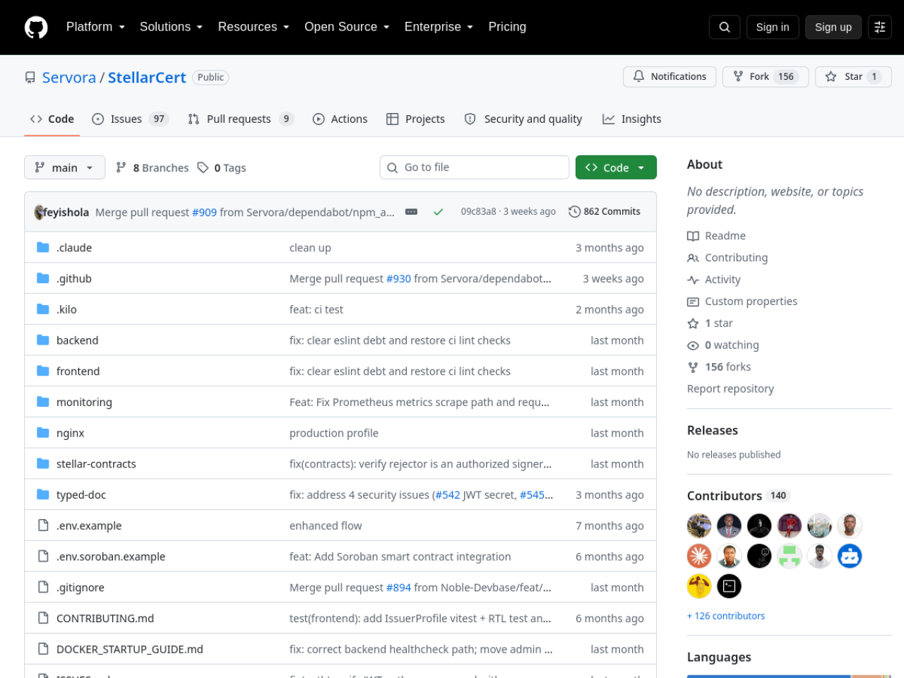
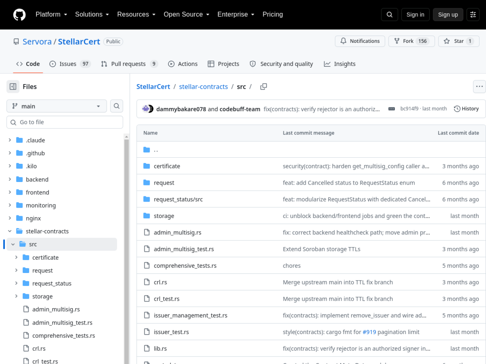

# StellarCert — Stellar Wave Research Submission

## Project Selected

- **Project:** StellarCert
- **Wave source:** [`Servora/StellarCert`](https://www.drips.network/wave/users/04546302-c502-4765-88f0-b373daab41a4), listed in the Stellar Wave Program directory on Drips
- **Category:** Tools (credentialing / certificate infrastructure)
- **Repository:** https://github.com/Servora/StellarCert
- **Live application:** _(none published — repository only)_
- **Network:** Stellar Testnet (target; no committed deployment ids)

## Eligibility And Duplicate Check

StellarCert appears in the Stellar Wave Program directory on Drips. A Hub
search for `stellarcert` returned zero matches when this research was
prepared, so it was not already listed on Stellar Wave Hub.

## What StellarCert Does

StellarCert is a decentralized certificate program management system built on
Stellar: authorized issuers create digital certificates and credentials,
anyone can verify their authenticity against the blockchain, and issuers can
revoke certificates when needed. The system targets the real problem of
credential fraud — course completions, professional certifications, and
program credentials that today are verified by emailing the issuer — by
anchoring issuance and revocation state on-chain where it cannot be quietly
altered.

The stack has three layers. A **React frontend** covers issuer dashboards,
verification pages, QR-code generation for easy certificate sharing, PDF
export, and statistics dashboards tracking total, active, and issuer
activity. A **NestJS backend** provides JWT-authenticated APIs with modules
for auth, certificates, issuers, Stellar integration, and user management,
backed by Postgres and Redis via Docker Compose. The core is the
**`stellar-contracts` Soroban workspace** (Rust): a 1,532-line certificate
contract implementing the full credential lifecycle — `initialize`,
issuer management (`add_issuer`, `remove_issuer`, `is_issuer`),
`issue_certificate`, `revoke_certificate`, `suspend`, `reinstate`,
`freeze`, `unfreeze`, `reissue`, metadata updates, validity checks, and a
two-phase certificate transfer flow (`initiate`, `accept`, `complete`,
`reject`, `cancel`) with transfer history. Supporting modules include
multi-signature admin operations (`admin_multisig.rs`, `multisig.rs`),
certificate revocation lists (`crl.rs`), metadata handling, storage TTL
management for persistent ledger entries, and certificate request workflow
state. The workspace has 11 Rust test files plus TypeScript contract tests,
and a `deploy-contracts.sh` script that builds the WASM and deploys to
Testnet (the default network) via the Soroban RPC.

Design details worth noting: expiration is derived from Stellar sequence
numbers rather than wall-clock time, keeping expiry trust-minimized; public
verification endpoints are IP-rate-limited; and the environment template
separates three contract ids (certificate, multisig, CRL) behind an
`ENABLE_SOROBAN_INTEGRATION` flag, so the app boots for development without
chain config but wires contracts in for production. The deployment ids are
environment-configured and no public instance was found, so — as with the
other pre-deployment projects profiled by this contributor — no contract id
is asserted here.

## On-Chain Verification

- **Contract source (verified):** the `stellar-contracts/` Soroban workspace
  implements the documented certificate lifecycle, issuer management,
  multisig admin, and CRL modules; the deploy script targets Testnet via
  `https://soroban-testnet.stellar.org` by default.
- **Deployment (not verifiable from public sources):** contract ids in
  `.env.soroban.example` are placeholders ("obtained from deployment
  script"); no live frontend instance exists at common deployment URLs.
  Consistent with the repository's own configuration-by-environment design,
  no contract or account id is asserted in this profile.
- **Wave participation (verified):** `Servora/StellarCert` is listed in the
  Stellar Wave Program directory on Drips with the program's assigned
  applicant and contribution issues.

## Screenshots

Included in this directory:

### StellarCert repository on GitHub

### stellar-contracts Soroban source directory

Both images are attached to the Hub submission as research images.

## Suggested Hub Submission

- **Name:** StellarCert
- **Category:** Tools
- **Network:** Testnet
- **Tags:** `soroban, certificates, credentials, verification, revocation, multisig, nestjs, react, stellar-wave`
- **Website:** _(none published)_
- **GitHub repository:** https://github.com/Servora/StellarCert
- **Soroban Contract ID:** _(none published — deployment ids are environment-configured; documented rather than asserted)_
- **Stellar Account ID:** _(none published)_

## Hub Submission Confirmed

- **Hub project ID:** `142`
- **Hub slug:** `stellarcert`
- **Submission status:** `submitted` (awaiting administrator review)
- **Submitted network:** `Testnet`
- **Research images:** 2 uploaded and attached to the Hub record
  ([repo](https://dlwcywvybsedgmcggmjn.supabase.co/storage/v1/object/public/research-images/85/1790380791205-k6o1zi.png),
  [contracts source](https://dlwcywvybsedgmcggmjn.supabase.co/storage/v1/object/public/research-images/85/1790380791527-a27uro.png))
- **Submitted by:** Syringe7 (contributor #85)

## Sources

1. [Drips Stellar Wave directory](https://www.drips.network/wave/users/04546302-c502-4765-88f0-b373daab41a4) — Servora/StellarCert Wave listing
2. [Servora/StellarCert repository](https://github.com/Servora/StellarCert) — README (features, architecture, deployment)
3. [stellar-contracts/src/lib.rs](https://github.com/Servora/StellarCert/blob/main/stellar-contracts/src/lib.rs) — certificate contract lifecycle (1,532 lines)
4. [.env.soroban.example](https://github.com/Servora/StellarCert/blob/main/.env.soroban.example) — three-contract env configuration, testnet defaults
5. [deploy-contracts.sh](https://github.com/Servora/StellarCert/blob/main/deploy-contracts.sh) — Testnet deployment procedure
6. [Stellar Wave Hub search](https://usestellarwavehub.vercel.app) — duplicate check (zero StellarCert matches)
