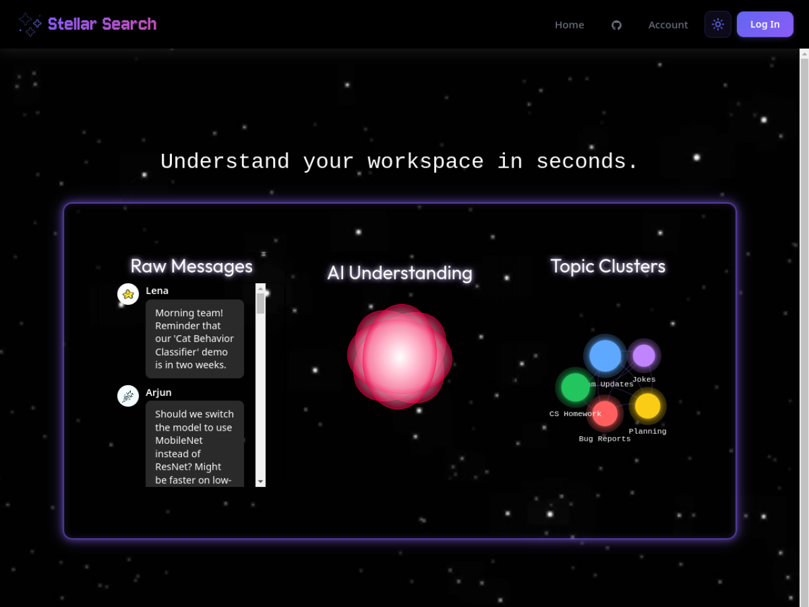
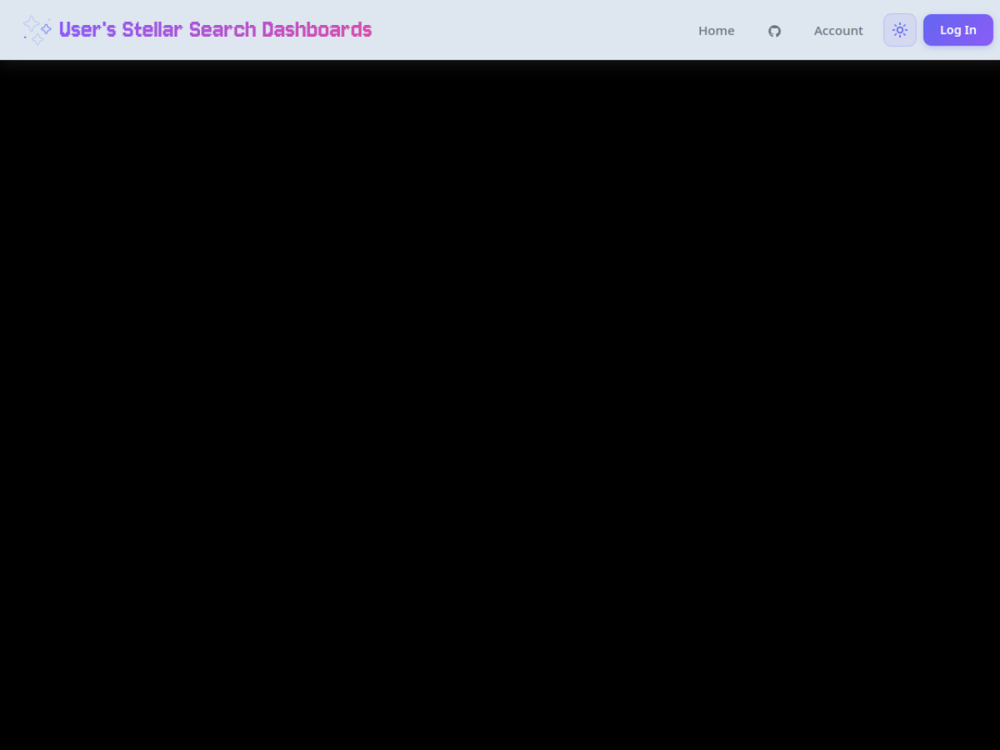
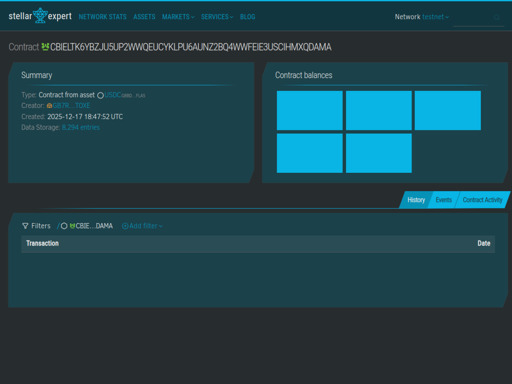

# StellarSearch — Stellar Wave Research Submission

## Project Selected

- **Project:** StellarSearch
- **Wave source:** [`Emmy123222/Stellar-Search`](https://www.drips.network/wave/stellar/repos), listed as an approved repository under the Stellar Agentic Hackathon cohort of the Stellar Wave Program (2x points)
- **Category:** Infrastructure
- **Repository:** https://github.com/Emmy123222/Stellar-Search
- **Network:** Stellar Testnet

## Eligibility And Duplicate Check

StellarSearch appears in the Drips catalog of repositories approved for the
Stellar Wave Program ("Stellar Agentic Hackathon" cohort). Hub searches for
`stellarsearch` and `stellar-search` returned zero matches when this research
was prepared, so it was not already listed on Stellar Wave Hub.

## What StellarSearch Does

StellarSearch is a pay-per-query web search API for autonomous AI agents. Every
search costs 0.001 USDC, settled on Stellar Testnet in roughly five seconds via
the x402 protocol — no subscriptions, no API keys for the end user. An agent
sends a request, receives an HTTP 402 challenge with the exact payment
requirements, signs a Soroban authorization entry with its Freighter wallet,
retries with the `X-Payment` header, and the OpenZeppelin x402 facilitator
verifies the signature and settles the 10,000-stroop micropayment on-chain
before the results come back.

The stack is deliberately "no mocks": Serper.dev supplies real Google search
results, an optional Groq API serves Llama 3.3 70B for the AI assistant
endpoints, and Stellar Horizon provides live balances and transaction history.
Search, image, and news endpoints share the same paid flow, and a
`/.well-known/x402` discovery document publishes the resource templates, price,
receiving address, and accepted Soroban USDC asset so autonomous clients can
integrate without human setup.

Engineering quality is a standout. A bounded preflight verifies the active
account, network, USDC trustline, spendable balance, and signer availability
before any signature is requested, mapping each failure to a single targeted
recovery action. Payment integrity code rejects replayed or duplicate payloads
inside a 300-second validity window and supports idempotency keys so browser or
proxy retries cannot double-charge. A circuit breaker isolates Serper outages
from paid flows, an append-only reconciliation log records every settlement,
and the same paid routes are exposed through Express, Vercel serverless
functions, and an MCP server so agents can consume StellarSearch as tools.

## On-Chain Verification

The project deploys no escrow of its own; x402 settles directly in the
testnet's native Soroban USDC, so the verifiable artifacts are the settlement
contract, the platform's receiving account, and the USDC issuer.

- **Testnet USDC SAC (settlement contract):**
  `CBIELTK6YBZJU5UP2WWQEUCYKLPU6AUNZ2BQ4WWFEIE3USCIHMXQDAMA` — resolves in the
  [Stellar Expert Testnet explorer](https://stellar.expert/explorer/testnet/contract/CBIELTK6YBZJU5UP2WWQEUCYKLPU6AUNZ2BQ4WWFEIE3USCIHMXQDAMA)
  with **190,379 contract invocations and over 1,000,000 events**, asset
  `USDC-GBBD47IF6LWK7P7MDEVSCWR7DPUWV3NY3DTQEVFL4NAT4AQH3ZLLFLA5`. This is the
  exact contract named in the repository README and TROUBLESHOOTING guide and
  hardcoded in the project's own test suite as the x402 settlement asset.
- **Platform receiving address:**
  `GDXA3V2LI3VN3GBH5BMOF25QSFJV7S7ZOWMHHQMJRPP4BVORDDRTIIMU` — confirmed live
  via the Horizon Testnet accounts endpoint, holding **19.89 testnet USDC and
  9,999.95 XLM**, with recent Soroban payment activity: the account's operation
  history shows `invoke_host_function` operations dated 2026-04-14 and
  2026-04-12, consistent with x402 settlement transfers to this address. The
  same address appears as the example `STELLAR_RECEIVING_ADDRESS` in the
  repository README.
- **Testnet USDC issuer:**
  `GBBD47IF6LWK7P7MDEVSCWR7DPUWV3NY3DTQEVFL4NAT4AQH3ZLLFLA5` — appears in the
  project's CI smoke workflow as the testnet USDC issuer and matches the asset
  issuer recorded on the settlement contract in Stellar Expert.

The chain of evidence ties the deployed testnet USDC contract, the issuer
behind it, and the funded receiving account together across three independent
sources (repository configuration, Stellar Expert, and Horizon), confirming
real micropayments have flowed through the platform's documented flow.

## Screenshots

Captured from the live testnet deployment and explorer, included in this
directory:

### Live search UI (stellar-search.vercel.app)

### x402 discovery endpoint

### Settlement contract on Stellar Expert

The first two images are also attached to the Hub submission as research
images.

## Suggested Hub Submission

- **Name:** StellarSearch
- **Category:** Infrastructure
- **Network:** Testnet
- **Tags:** `x402, ai-agents, search, usdc, soroban, freighter, pay-per-use, api, mcp, stellar-wave`
- **Website:** (none published — the preview deployment is project-internal)
- **GitHub repository:** https://github.com/Emmy123222/Stellar-Search
- **Soroban Contract ID:** `CBIELTK6YBZJU5UP2WWQEUCYKLPU6AUNZ2BQ4WWFEIE3USCIHMXQDAMA` (testnet USDC settlement contract)
- **Stellar Account ID:** `GDXA3V2LI3VN3GBH5BMOF25QSFJV7S7ZOWMHHQMJRPP4BVORDDRTIIMU` (platform receiving address)

## Hub Submission Confirmed

- **Hub project ID:** `135`
- **Hub slug:** `stellarsearch`
- **Submission status:** `submitted` (awaiting administrator review)
- **Submitted network:** `Testnet`
- **Research images:** 2 uploaded and attached to the Hub record
  ([search UI](https://dlwcywvybsedgmcggmjn.supabase.co/storage/v1/object/public/research-images/85/1790375313546-4rsxen.png),
  [x402 discovery](https://dlwcywvybsedgmcggmjn.supabase.co/storage/v1/object/public/research-images/85/1790375313867-58czw1.png))
- **Submitted by:** Syringe7 (contributor #85)

## Sources

1. [Drips Stellar Wave repository catalog](https://www.drips.network/wave/stellar/repos)
2. [StellarSearch repository](https://github.com/Emmy123222/Stellar-Search) — README (x402 flow, environment reference, payment integrity)
3. [TROUBLESHOOTING.md](https://github.com/Emmy123222/Stellar-Search/blob/main/TROUBLESHOOTING.md) — settlement contract and receiving-address references
4. [StellarSearch CI smoke workflow](https://github.com/Emmy123222/Stellar-Search/blob/main/.github/workflows/smoke.yml) — testnet USDC issuer constant
5. [Testnet USDC settlement contract on Stellar Expert](https://stellar.expert/explorer/testnet/contract/CBIELTK6YBZJU5UP2WWQEUCYKLPU6AUNZ2BQ4WWFEIE3USCIHMXQDAMA) — invocation and event counts
6. [Receiving account on Horizon Testnet](https://horizon-testnet.stellar.org/accounts/GDXA3V2LI3VN3GBH5BMOF25QSFJV7S7ZOWMHHQMJRPP4BVORDDRTIIMU) — balances and Soroban payment history
7. [x402 protocol](https://www.x402.org) — HTTP 402 payment challenge/settlement flow and OpenZeppelin facilitator
8. [Live deployment health endpoint](https://stellar-search.vercel.app/api/health) — confirms the Vercel deployment serves the StellarSearch API
