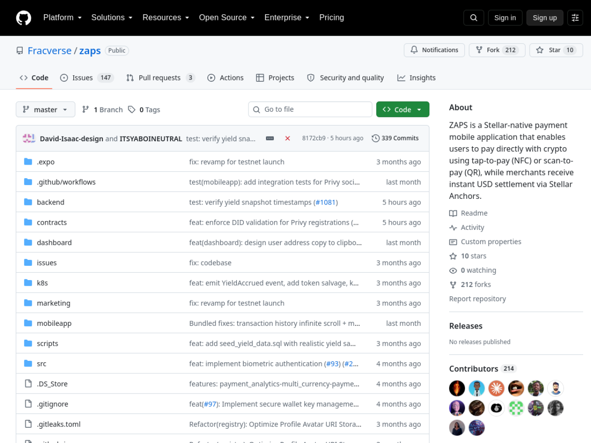
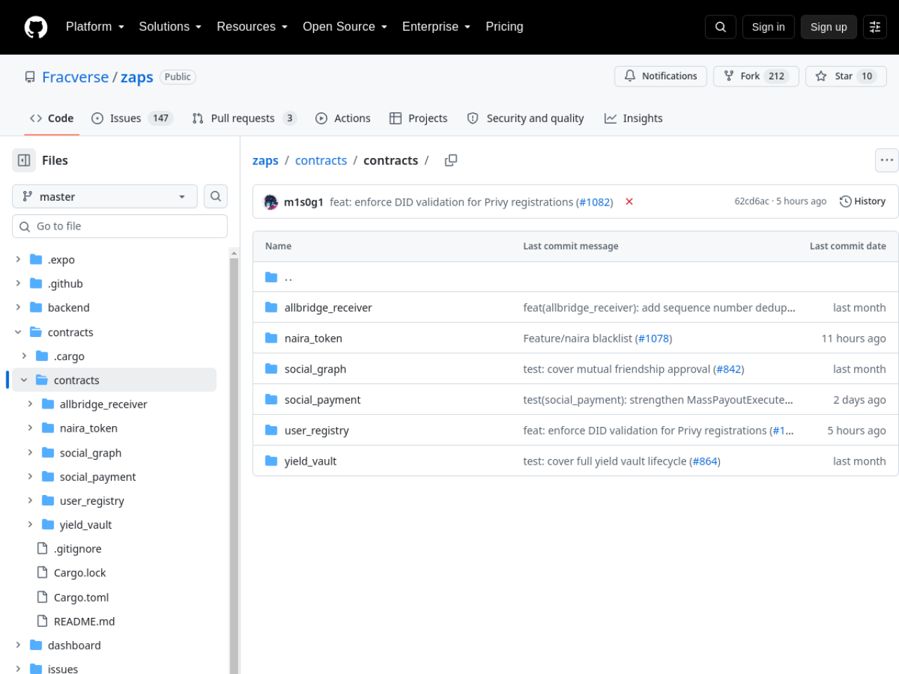

# ZAPS — Stellar Wave Research Submission

## Project Selected

- **Project:** ZAPS
- **Wave source:** [`Fracverse/zaps`](https://www.drips.network/wave/users/04546302-c502-4765-88f0-b373daab41a4), listed in the Stellar Wave Program directory on Drips (assigned contribution issues with 100-point bounties)
- **Category:** Payments (social payments)
- **Repository:** https://github.com/Fracverse/zaps
- **Live application:** _(mobile/dashboard app; no public deployment URL published)_
- **Network:** Stellar Testnet (target; no committed deployment ids)

## Eligibility And Duplicate Check

ZAPS appears in the Stellar Wave Program directory on Drips (the repo's
contribution issues carry point bounties on the Wave program). A Hub search
for `zaps` returned zero matches when this research was prepared, so it was
not already listed on Stellar Wave Hub.

## What ZAPS Does

ZAPS is a high-speed, interactive social payments platform on Stellar: it
turns standard financial transactions into peer-to-peer social interactions,
in the vein of Venmo or Cash App. Users pay friends with comments and likes
attached, share payments publicly, friends-only, or privately, and fund
their wallets both from fiat and from other blockchains.

The architecture spans four components. The **Soroban contracts workspace**
implements five contracts (~5,000 lines of Rust, all fully implemented with
test snapshots — no stubs):

- **`user_registry`** — maps Stellar addresses to profiles and custom Zaps
  IDs (e.g. `ebube.zaps`), a handle system for social payments;
- **`social_payment`** (1,895 lines) — executes peer-to-peer payments
  on-chain with transaction notes, amounts, and visibility settings
  (Public / Friends-only / Private), emitting social transaction events;
- **`social_graph`** — friend links and relationship state on-chain to
  enforce privacy permissions (with tests covering mutual friendship,
  self-friend rejection, and request flows);
- **`naira_token`** — a Naira-pegged stablecoin anchor interface used as the
  fiat rails of the social ecosystem;
- **`allbridge_receiver`** — receives cross-chain deposits via the Allbridge
  relayer to fund user wallets from Solana, EVM chains, and more.

An **Axum Rust backend** manages off-chain social logs (likes, comments,
friend lists) and indexes Stellar ledger events; a **React Native (Expo)
mobile app** handles social payment interactions, profiles, and Allbridge
cross-chain funding; and a **Next.js dashboard** monitors social statistics,
Naira transaction volume, bridging queues, payouts, and contract state.
Fiat on/off-ramps run through regulated Stellar Anchors (SEP-24 / SEP-38),
and the repo carries security hygiene (gitleaks config, nonce
implementation, blacklist/rescue-token implementation notes) plus DevOps
issues covering Docker, K8s deployment, and OpenAPI documentation.

No public deployment of the contracts is recorded — contract ids are not
committed and no hosted instance was found — so, consistent with the
project's stage, no contract id is asserted in this profile.

## On-Chain Verification

- **Contract source (verified):** all five Soroban contracts are fully
  implemented in `contracts/contracts/*/src/lib.rs` (~5,000 lines total,
  zero `todo!()` stubs) with unit tests and test snapshots covering the
  social graph and payment flows.
- **Wave participation (verified):** `Fracverse/zaps` appears on the Drips
  Wave program page with assigned contribution issues (100-point bounty).
- **Deployment (not verifiable from public sources):** no committed contract
  ids and no live hosted instance; the mobile app and dashboard are run
  locally per the README. No contract or account id is asserted here.

## Screenshots

Included in this directory:

### ZAPS repository on GitHub

### Soroban contracts workspace

Both images are attached to the Hub submission as research images.

## Suggested Hub Submission

- **Name:** ZAPS
- **Category:** Payments
- **Network:** Testnet
- **Tags:** `soroban, social-payments, anchors, sep-24, sep-38, allbridge, cross-chain, stablecoin, mobile, stellar-wave`
- **Website:** _(none published)_
- **GitHub repository:** https://github.com/Fracverse/zaps
- **Soroban Contract ID:** _(none published — no public deployment record; documented rather than asserted)_
- **Stellar Account ID:** _(none published)_

## Hub Submission Confirmed

- **Hub project ID:** `144`
- **Hub slug:** `zaps`
- **Submission status:** `submitted` (awaiting administrator review)
- **Submitted network:** `Testnet`
- **Research images:** 2 uploaded and attached to the Hub record
  ([repo](https://dlwcywvybsedgmcggmjn.supabase.co/storage/v1/object/public/research-images/85/1790382460763-8g0ynt.png),
  [contracts](https://dlwcywvybsedgmcggmjn.supabase.co/storage/v1/object/public/research-images/85/1790382461072-e5vywh.png))
- **Submitted by:** Syringe7 (contributor #85)

## Sources

1. [Drips Stellar Wave directory](https://www.drips.network/wave/users/04546302-c502-4765-88f0-b373daab41a4) — Fracverse/zaps Wave listing with bounty issues
2. [Fracverse/zaps repository](https://github.com/Fracverse/zaps) — Readme (product scope, features, architecture)
3. [contracts/README.md](https://github.com/Fracverse/zaps/blob/master/contracts/README.md) — five-contract workspace architecture
4. Contract sources (`social_payment`, `user_registry`, `social_graph`, `naira_token`, `allbridge_receiver`) — implementation depth verified
5. [Stellar Wave Hub search](https://usestellarwavehub.vercel.app) — duplicate check (zero ZAPS matches)
